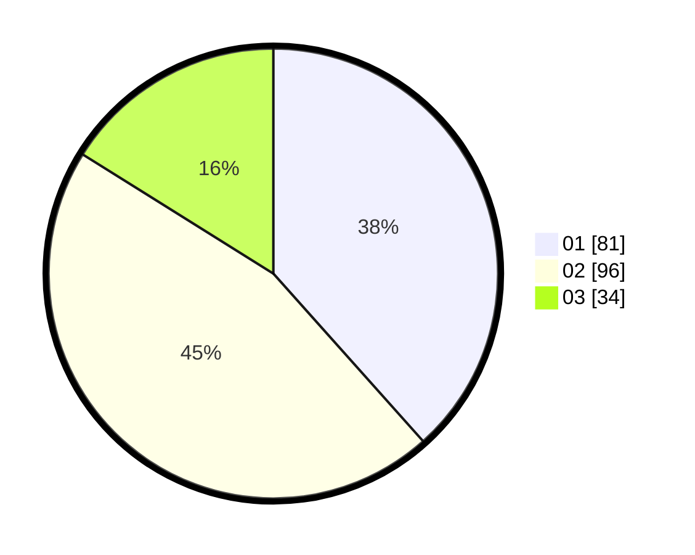

# Hasil

Hasil perolehan suara paslon dapat dilihat pada file paslon-01.txt, paslon-02.txt, dan paslon-03.txt.

Jika tidak ada, artinya data tersebut belum ada pada SIREKAP.

## Perolehan Suara

 * Paslon 01: **81**.
 * Paslon 02: **96**.
 * Paslon 03: **34**.

## Foto C Plano

https://sirekap-obj-formc.kpu.go.id/6537/pemilu/ppwp/31/71/01/10/02/3171011002045-20240214-194121--7ae0be1c-8311-42c5-931e-01eafdcd8707.jpg

https://sirekap-obj-formc.kpu.go.id/6537/pemilu/ppwp/31/71/01/10/02/3171011002045-20240214-160156--3cd1da78-cc01-4fda-ae23-e1a6375cabc2.jpg

https://sirekap-obj-formc.kpu.go.id/6537/pemilu/ppwp/31/71/01/10/02/3171011002045-20240216-031408--0bfcd5c9-581b-49a4-a5b9-e3015b1392cb.jpg

## DATA PEMILIH TETAP

Jumlah pemilih dalam DPT: **298**.
 * L: **161**.
 * P: **137**.

## DATA PENGGUNA HAK PILIH

Jumlah pengguna hak pilih dalam DPT: **208**.
 * L: **110**.
 * P: **98**.

Jumlah pengguna hak pilih dalam DPTb: **6**.
 * L: **3**.
 * P: **3**.

Jumlah pengguna hak pilih dalam DPK: **2**.
 * L: **1**.
 * P: **1**.

Jumlah pengguna hak pilih: **216**.
 * L: **114**.
 * P: **102**.

## JUMLAH SUARA SAH DAN TIDAK SAH

JUMLAH SELURUH SUARA SAH: **211**.

JUMLAH SUARA TIDAK SAH: **5**.

JUMLAH SELURUH SUARA SAH DAN SUARA TIDAK SAH: **216**.
