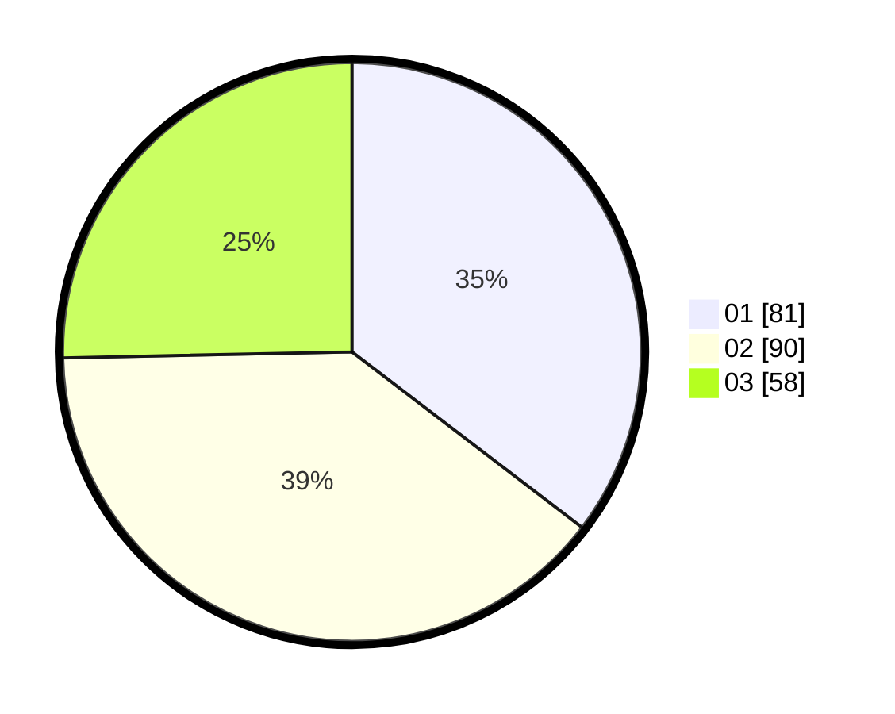

# Hasil

Hasil perolehan suara paslon dapat dilihat pada file paslon-01.txt, paslon-02.txt, dan paslon-03.txt.

Jika tidak ada, artinya data tersebut belum ada pada SIREKAP.

## Perolehan Suara

 * Paslon 01: **81**.
 * Paslon 02: **90**.
 * Paslon 03: **58**.

## Foto C Plano

https://sirekap-obj-formc.kpu.go.id/446c/pemilu/ppwp/31/71/01/10/02/3171011002048-20240215-202043--84aa3002-b6de-4f3e-832d-da761ed08783.jpg

https://sirekap-obj-formc.kpu.go.id/446c/pemilu/ppwp/31/71/01/10/02/3171011002048-20240215-202110--65a2c347-2476-4297-988b-ee108d773073.jpg

https://sirekap-obj-formc.kpu.go.id/446c/pemilu/ppwp/31/71/01/10/02/3171011002048-20240215-202056--fa2eb330-6ccc-4467-b77f-77dd3b48f729.jpg

## DATA PEMILIH TETAP

Jumlah pemilih dalam DPT: **265**.
 * L: **124**.
 * P: **141**.

## DATA PENGGUNA HAK PILIH

Jumlah pengguna hak pilih dalam DPT: **227**.
 * L: **96**.
 * P: **131**.

Jumlah pengguna hak pilih dalam DPTb: **2**.
 * L: **0**.
 * P: **2**.

Jumlah pengguna hak pilih dalam DPK: **2**.
 * L: **0**.
 * P: **2**.

Jumlah pengguna hak pilih: **231**.
 * L: **96**.
 * P: **135**.

## JUMLAH SUARA SAH DAN TIDAK SAH

JUMLAH SELURUH SUARA SAH: **229**.

JUMLAH SUARA TIDAK SAH: **2**.

JUMLAH SELURUH SUARA SAH DAN SUARA TIDAK SAH: **231**.
