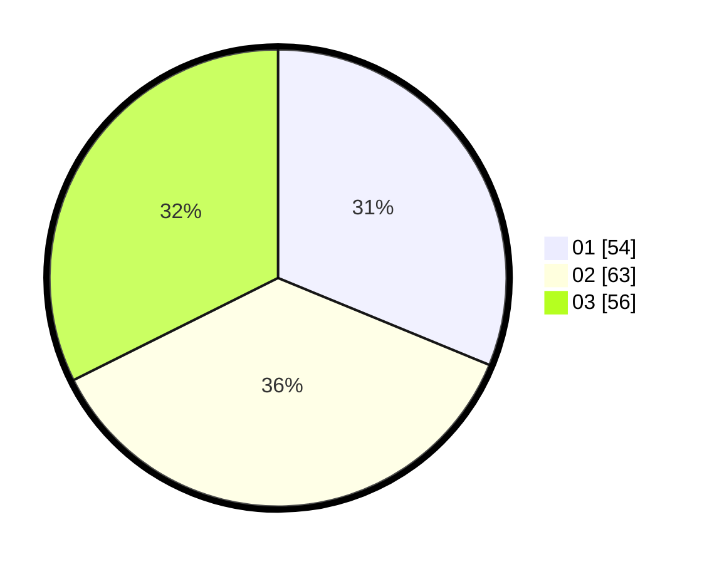

# Hasil

Hasil perolehan suara paslon dapat dilihat pada file paslon-01.txt, paslon-02.txt, dan paslon-03.txt.

Jika tidak ada, artinya data tersebut belum ada pada SIREKAP.

## Perolehan Suara

 * Paslon 01: **54**.
 * Paslon 02: **63**.
 * Paslon 03: **56**.

## Foto C Plano

https://sirekap-obj-formc.kpu.go.id/e409/pemilu/ppwp/31/71/01/10/02/3171011002053-20240215-211400--ff3a427a-67d4-4190-9ab0-780c39900455.jpg

https://sirekap-obj-formc.kpu.go.id/e409/pemilu/ppwp/31/71/01/10/02/3171011002053-20240215-211404--1e09c1a6-c00e-4de2-a777-84c74dc28e88.jpg

https://sirekap-obj-formc.kpu.go.id/e409/pemilu/ppwp/31/71/01/10/02/3171011002053-20240215-211402--dd79178e-0041-4bcf-ac3a-4866f63cdb14.jpg

## DATA PEMILIH TETAP

Jumlah pemilih dalam DPT: **217**.
 * L: **104**.
 * P: **113**.

## DATA PENGGUNA HAK PILIH

Jumlah pengguna hak pilih dalam DPT: **163**.
 * L: **73**.
 * P: **90**.

Jumlah pengguna hak pilih dalam DPTb: **9**.
 * L: **9**.
 * P: **0**.

Jumlah pengguna hak pilih dalam DPK: **1**.
 * L: **1**.
 * P: **0**.

Jumlah pengguna hak pilih: **173**.
 * L: **83**.
 * P: **90**.

## JUMLAH SUARA SAH DAN TIDAK SAH

JUMLAH SELURUH SUARA SAH: **173**.

JUMLAH SUARA TIDAK SAH: **0**.

JUMLAH SELURUH SUARA SAH DAN SUARA TIDAK SAH: **173**.
