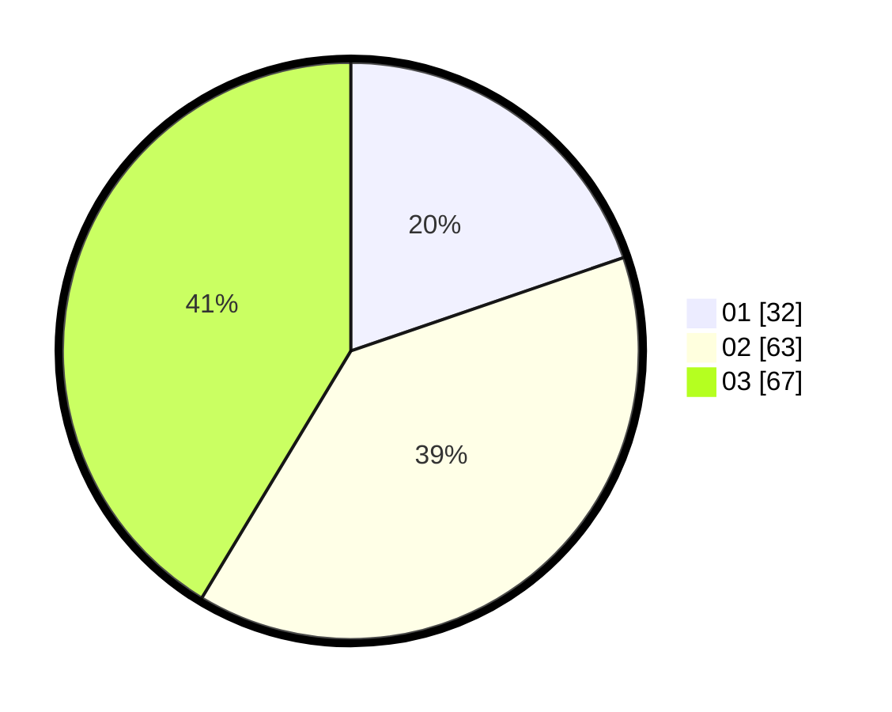

# Hasil

Hasil perolehan suara paslon dapat dilihat pada file paslon-01.txt, paslon-02.txt, dan paslon-03.txt.

Jika tidak ada, artinya data tersebut belum ada pada SIREKAP.

## Perolehan Suara

 * Paslon 01: **32**.
 * Paslon 02: **63**.
 * Paslon 03: **67**.

## Foto C Plano

https://sirekap-obj-formc.kpu.go.id/670f/pemilu/ppwp/31/71/01/10/03/3171011003010-20240215-003926--c069eba1-6c43-49b4-ae0b-54c3aa1d150e.jpg

https://sirekap-obj-formc.kpu.go.id/670f/pemilu/ppwp/31/71/01/10/03/3171011003010-20240215-004033--6db9cc97-035e-4119-a3ab-979f365446d3.jpg

https://sirekap-obj-formc.kpu.go.id/670f/pemilu/ppwp/31/71/01/10/03/3171011003010-20240215-004159--f442dacc-bc01-41f7-a14a-129a83f35c5f.jpg

## DATA PEMILIH TETAP

Jumlah pemilih dalam DPT: **245**.
 * L: **118**.
 * P: **127**.

## DATA PENGGUNA HAK PILIH

Jumlah pengguna hak pilih dalam DPT: **154**.
 * L: **77**.
 * P: **77**.

Jumlah pengguna hak pilih dalam DPTb: **8**.
 * L: **4**.
 * P: **4**.

Jumlah pengguna hak pilih dalam DPK: **4**.
 * L: **3**.
 * P: **1**.

Jumlah pengguna hak pilih: **166**.
 * L: **84**.
 * P: **82**.

## JUMLAH SUARA SAH DAN TIDAK SAH

JUMLAH SELURUH SUARA SAH: **162**.

JUMLAH SUARA TIDAK SAH: **4**.

JUMLAH SELURUH SUARA SAH DAN SUARA TIDAK SAH: **166**.
