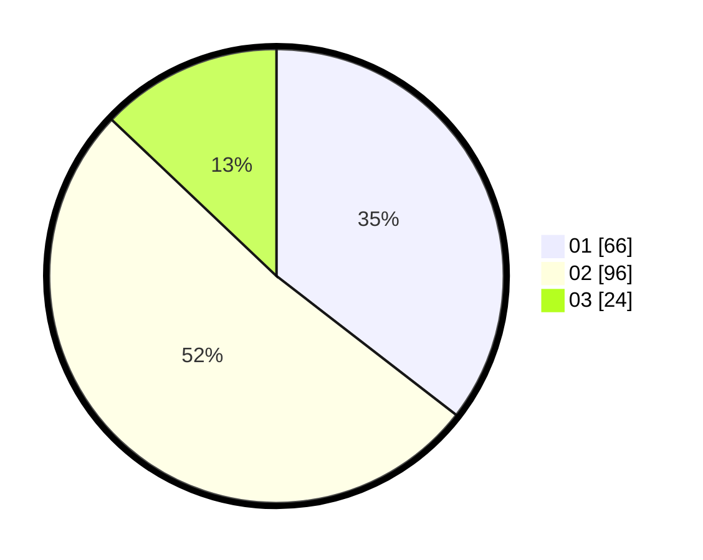

# Hasil

Hasil perolehan suara paslon dapat dilihat pada file paslon-01.txt, paslon-02.txt, dan paslon-03.txt.

Jika tidak ada, artinya data tersebut belum ada pada SIREKAP.

## Perolehan Suara

 * Paslon 01: **66**.
 * Paslon 02: **96**.
 * Paslon 03: **24**.

## Foto C Plano

https://sirekap-obj-formc.kpu.go.id/e694/pemilu/ppwp/31/71/01/10/03/3171011003012-20240214-155440--d20a566b-84e1-4620-a060-3ca20cba6470.jpg

https://sirekap-obj-formc.kpu.go.id/e694/pemilu/ppwp/31/71/01/10/03/3171011003012-20240214-155634--a926ff52-a743-40bd-b610-a6c09c60ab08.jpg

https://sirekap-obj-formc.kpu.go.id/e694/pemilu/ppwp/31/71/01/10/03/3171011003012-20240214-160116--5b1400b5-94ef-48e7-b579-32f8e32150e3.jpg

## DATA PEMILIH TETAP

Jumlah pemilih dalam DPT: **245**.
 * L: **123**.
 * P: **122**.

## DATA PENGGUNA HAK PILIH

Jumlah pengguna hak pilih dalam DPT: **181**.
 * L: **85**.
 * P: **96**.

Jumlah pengguna hak pilih dalam DPTb: **5**.
 * L: **2**.
 * P: **3**.

Jumlah pengguna hak pilih dalam DPK: **0**.
 * L: **0**.
 * P: **0**.

Jumlah pengguna hak pilih: **186**.
 * L: **87**.
 * P: **99**.

## JUMLAH SUARA SAH DAN TIDAK SAH

JUMLAH SELURUH SUARA SAH: **186**.

JUMLAH SUARA TIDAK SAH: **0**.

JUMLAH SELURUH SUARA SAH DAN SUARA TIDAK SAH: **186**.
