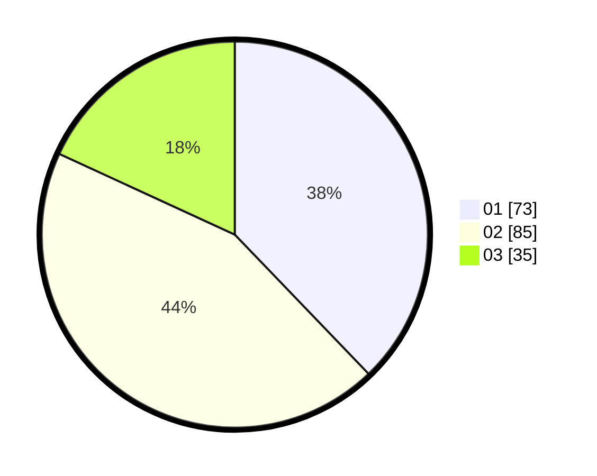

# Hasil

Hasil perolehan suara paslon dapat dilihat pada file paslon-01.txt, paslon-02.txt, dan paslon-03.txt.

Jika tidak ada, artinya data tersebut belum ada pada SIREKAP.

## Perolehan Suara

 * Paslon 01: **73**.
 * Paslon 02: **85**.
 * Paslon 03: **35**.

## Foto C Plano

https://sirekap-obj-formc.kpu.go.id/9d20/pemilu/ppwp/31/71/01/10/03/3171011003017-20240215-235726--83ea4295-3000-4a4b-ad24-33981091e014.jpg

https://sirekap-obj-formc.kpu.go.id/9d20/pemilu/ppwp/31/71/01/10/03/3171011003017-20240215-235727--0749bc82-9331-47f9-bda6-5600007c3de3.jpg

https://sirekap-obj-formc.kpu.go.id/9d20/pemilu/ppwp/31/71/01/10/03/3171011003017-20240215-235726--9ec323d2-c14d-4c7e-bb0a-f1c8acba66f0.jpg

## DATA PEMILIH TETAP

Jumlah pemilih dalam DPT: **258**.
 * L: **134**.
 * P: **124**.

## DATA PENGGUNA HAK PILIH

Jumlah pengguna hak pilih dalam DPT: **190**.
 * L: **91**.
 * P: **99**.

Jumlah pengguna hak pilih dalam DPTb: **1**.
 * L: **1**.
 * P: **0**.

Jumlah pengguna hak pilih dalam DPK: **3**.
 * L: **2**.
 * P: **1**.

Jumlah pengguna hak pilih: **194**.
 * L: **94**.
 * P: **100**.

## JUMLAH SUARA SAH DAN TIDAK SAH

JUMLAH SELURUH SUARA SAH: **193**.

JUMLAH SUARA TIDAK SAH: **1**.

JUMLAH SELURUH SUARA SAH DAN SUARA TIDAK SAH: **194**.
