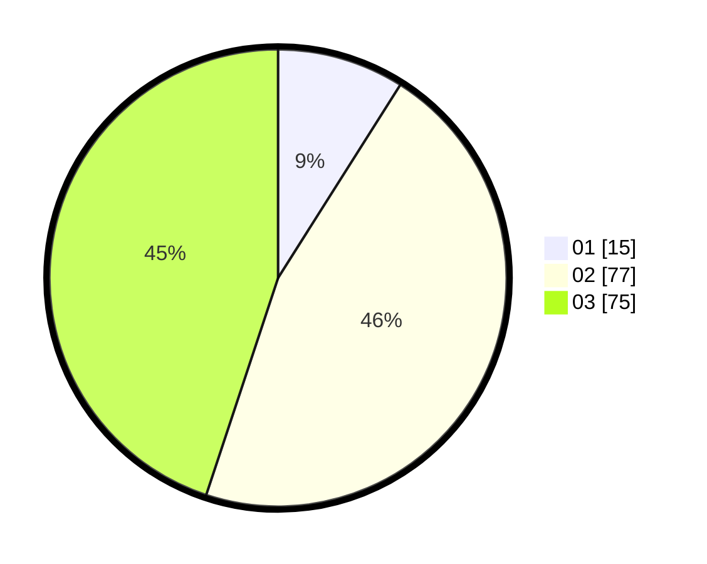

# Hasil

Hasil perolehan suara paslon dapat dilihat pada file paslon-01.txt, paslon-02.txt, dan paslon-03.txt.

Jika tidak ada, artinya data tersebut belum ada pada SIREKAP.

## Perolehan Suara

 * Paslon 01: **15**.
 * Paslon 02: **77**.
 * Paslon 03: **75**.

## Foto C Plano

https://sirekap-obj-formc.kpu.go.id/5ed4/pemilu/ppwp/31/71/01/10/03/3171011003030-20240214-213811--5d37165d-8b74-4a98-99a7-f9507f94007d.jpg

https://sirekap-obj-formc.kpu.go.id/5ed4/pemilu/ppwp/31/71/01/10/03/3171011003030-20240214-193333--b7743acb-6339-4f27-b9f0-00d8ed999564.jpg

https://sirekap-obj-formc.kpu.go.id/5ed4/pemilu/ppwp/31/71/01/10/03/3171011003030-20240214-193350--0ea114a3-1899-472c-94e1-3304ea57fc18.jpg

## DATA PEMILIH TETAP

Jumlah pemilih dalam DPT: **218**.
 * L: **104**.
 * P: **114**.

## DATA PENGGUNA HAK PILIH

Jumlah pengguna hak pilih dalam DPT: **159**.
 * L: **74**.
 * P: **85**.

Jumlah pengguna hak pilih dalam DPTb: **9**.
 * L: **2**.
 * P: **7**.

Jumlah pengguna hak pilih dalam DPK: **3**.
 * L: **2**.
 * P: **1**.

Jumlah pengguna hak pilih: **171**.
 * L: **78**.
 * P: **93**.

## JUMLAH SUARA SAH DAN TIDAK SAH

JUMLAH SELURUH SUARA SAH: **167**.

JUMLAH SUARA TIDAK SAH: **4**.

JUMLAH SELURUH SUARA SAH DAN SUARA TIDAK SAH: **171**.
