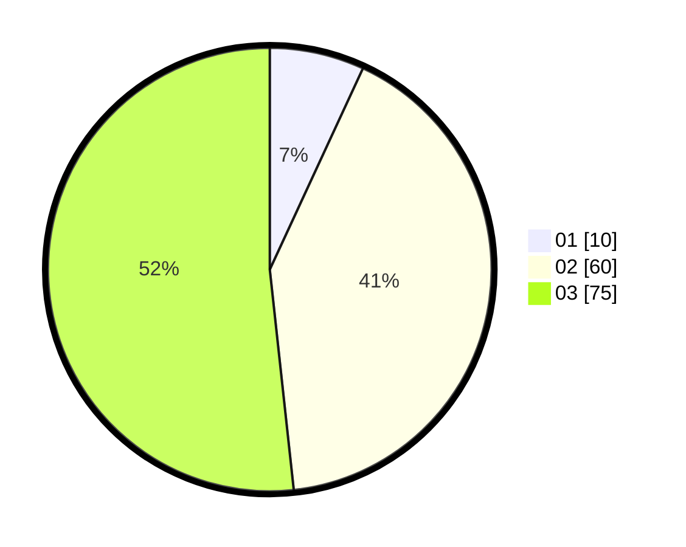

# Hasil

Hasil perolehan suara paslon dapat dilihat pada file paslon-01.txt, paslon-02.txt, dan paslon-03.txt.

Jika tidak ada, artinya data tersebut belum ada pada SIREKAP.

## Perolehan Suara

 * Paslon 01: **10**.
 * Paslon 02: **60**.
 * Paslon 03: **75**.

## Foto C Plano

https://sirekap-obj-formc.kpu.go.id/2594/pemilu/ppwp/31/71/01/10/03/3171011003032-20240215-230646--1b5de9eb-2d12-42a1-89aa-82187f6f50c1.jpg

https://sirekap-obj-formc.kpu.go.id/2594/pemilu/ppwp/31/71/01/10/03/3171011003032-20240215-230653--38e34000-23cf-4987-a33a-537f92c05f00.jpg

https://sirekap-obj-formc.kpu.go.id/2594/pemilu/ppwp/31/71/01/10/03/3171011003032-20240215-230649--9386a980-6271-4a32-9755-44aee6398f4f.jpg

## DATA PEMILIH TETAP

Jumlah pemilih dalam DPT: **138**.
 * L: **68**.
 * P: **70**.

## DATA PENGGUNA HAK PILIH

Jumlah pengguna hak pilih dalam DPT: **138**.
 * L: **68**.
 * P: **70**.

Jumlah pengguna hak pilih dalam DPTb: **8**.
 * L: **5**.
 * P: **3**.

Jumlah pengguna hak pilih dalam DPK: **1**.
 * L: **0**.
 * P: **1**.

Jumlah pengguna hak pilih: **147**.
 * L: **73**.
 * P: **74**.

## JUMLAH SUARA SAH DAN TIDAK SAH

JUMLAH SELURUH SUARA SAH: **145**.

JUMLAH SUARA TIDAK SAH: **2**.

JUMLAH SELURUH SUARA SAH DAN SUARA TIDAK SAH: **147**.
