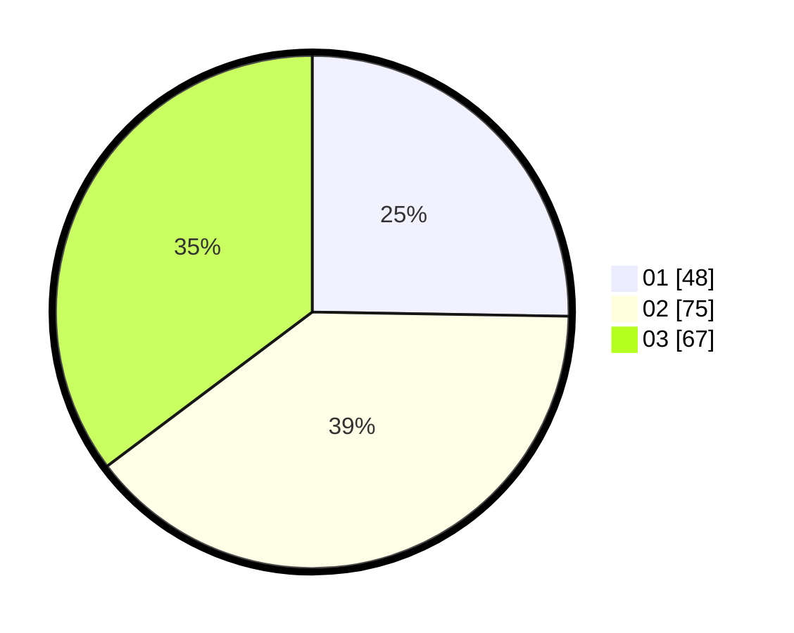

# Hasil

Hasil perolehan suara paslon dapat dilihat pada file paslon-01.txt, paslon-02.txt, dan paslon-03.txt.

Jika tidak ada, artinya data tersebut belum ada pada SIREKAP.

## Perolehan Suara

 * Paslon 01: **48**.
 * Paslon 02: **75**.
 * Paslon 03: **67**.

## Foto C Plano

https://sirekap-obj-formc.kpu.go.id/7b6a/pemilu/ppwp/31/71/01/10/03/3171011003033-20240216-053507--d9ffe6a6-d41c-4d48-9b89-2dba60a19e74.jpg

https://sirekap-obj-formc.kpu.go.id/7b6a/pemilu/ppwp/31/71/01/10/03/3171011003033-20240215-160239--11ad2596-a581-4adf-ab1d-64d6a5d89395.jpg

https://sirekap-obj-formc.kpu.go.id/7b6a/pemilu/ppwp/31/71/01/10/03/3171011003033-20240216-053242--d18820b0-8e5e-426e-9e36-5f8b22b50d97.jpg

## DATA PEMILIH TETAP

Jumlah pemilih dalam DPT: **265**.
 * L: **147**.
 * P: **118**.

## DATA PENGGUNA HAK PILIH

Jumlah pengguna hak pilih dalam DPT: **187**.
 * L: **102**.
 * P: **85**.

Jumlah pengguna hak pilih dalam DPTb: **4**.
 * L: **2**.
 * P: **2**.

Jumlah pengguna hak pilih dalam DPK: **0**.
 * L: **0**.
 * P: **0**.

Jumlah pengguna hak pilih: **191**.
 * L: **104**.
 * P: **87**.

## JUMLAH SUARA SAH DAN TIDAK SAH

JUMLAH SELURUH SUARA SAH: **190**.

JUMLAH SUARA TIDAK SAH: **1**.

JUMLAH SELURUH SUARA SAH DAN SUARA TIDAK SAH: **191**.
