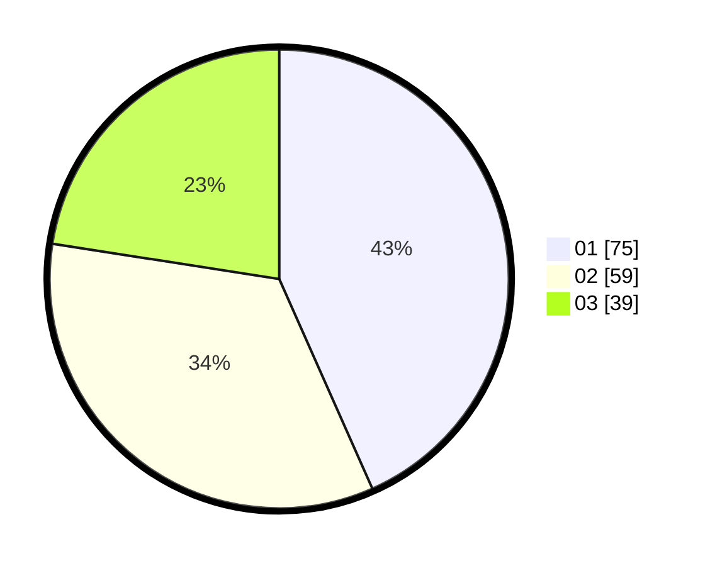

# Hasil

Hasil perolehan suara paslon dapat dilihat pada file paslon-01.txt, paslon-02.txt, dan paslon-03.txt.

Jika tidak ada, artinya data tersebut belum ada pada SIREKAP.

## Perolehan Suara

 * Paslon 01: **75**.
 * Paslon 02: **59**.
 * Paslon 03: **39**.

## Foto C Plano

https://sirekap-obj-formc.kpu.go.id/e826/pemilu/ppwp/31/71/01/10/03/3171011003036-20240214-195620--827a8956-d194-466e-98ac-160dda560b57.jpg

https://sirekap-obj-formc.kpu.go.id/e826/pemilu/ppwp/31/71/01/10/03/3171011003036-20240214-195628--e91f80c4-48b9-4f9e-8510-401302cce9d3.jpg

https://sirekap-obj-formc.kpu.go.id/e826/pemilu/ppwp/31/71/01/10/03/3171011003036-20240214-195634--7c6a2067-0afa-4a5e-9c8b-5e80f2530e2f.jpg

## DATA PEMILIH TETAP

Jumlah pemilih dalam DPT: **265**.
 * L: **130**.
 * P: **135**.

## DATA PENGGUNA HAK PILIH

Jumlah pengguna hak pilih dalam DPT: **169**.
 * L: **77**.
 * P: **92**.

Jumlah pengguna hak pilih dalam DPTb: **3**.
 * L: **1**.
 * P: **2**.

Jumlah pengguna hak pilih dalam DPK: **3**.
 * L: **3**.
 * P: **0**.

Jumlah pengguna hak pilih: **175**.
 * L: **81**.
 * P: **94**.

## JUMLAH SUARA SAH DAN TIDAK SAH

JUMLAH SELURUH SUARA SAH: **173**.

JUMLAH SUARA TIDAK SAH: **2**.

JUMLAH SELURUH SUARA SAH DAN SUARA TIDAK SAH: **175**.
