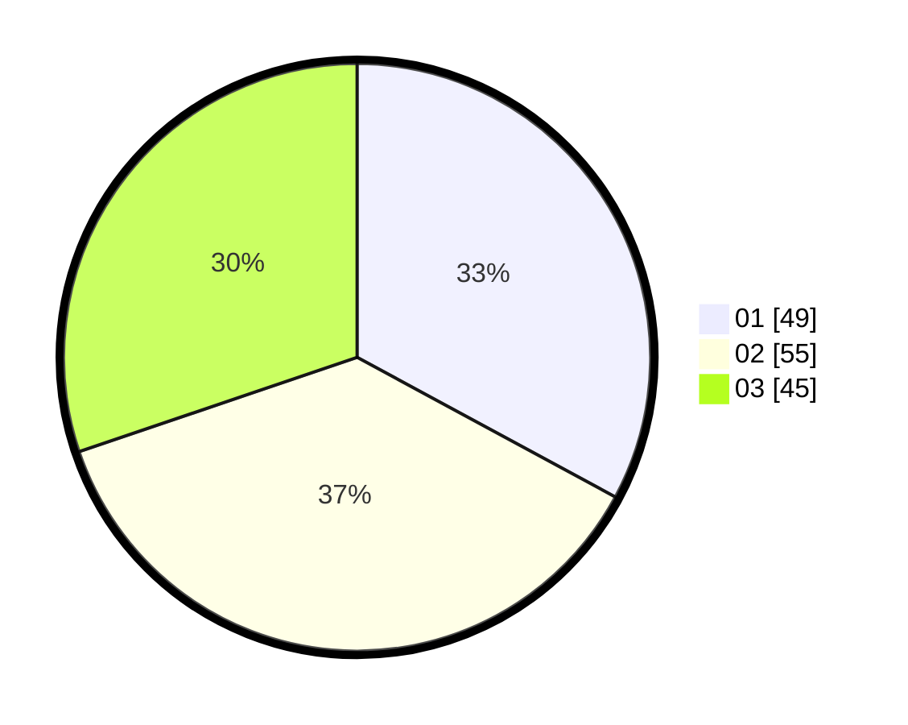

# Hasil

Hasil perolehan suara paslon dapat dilihat pada file paslon-01.txt, paslon-02.txt, dan paslon-03.txt.

Jika tidak ada, artinya data tersebut belum ada pada SIREKAP.

## Perolehan Suara

 * Paslon 01: **49**.
 * Paslon 02: **55**.
 * Paslon 03: **45**.

## Foto C Plano

https://sirekap-obj-formc.kpu.go.id/0d2d/pemilu/ppwp/31/71/01/10/03/3171011003041-20240214-224710--434e773e-2b78-4517-90b8-2109c87f48d8.jpg

https://sirekap-obj-formc.kpu.go.id/0d2d/pemilu/ppwp/31/71/01/10/03/3171011003041-20240214-224812--3a1e70c9-c00d-4a5c-8fdf-674e261c66dc.jpg

https://sirekap-obj-formc.kpu.go.id/0d2d/pemilu/ppwp/31/71/01/10/03/3171011003041-20240214-211528--aabf2880-86ee-42cf-9a99-4b6c35f19e0e.jpg

## DATA PEMILIH TETAP

Jumlah pemilih dalam DPT: **198**.
 * L: **94**.
 * P: **104**.

## DATA PENGGUNA HAK PILIH

Jumlah pengguna hak pilih dalam DPT: **147**.
 * L: **70**.
 * P: **77**.

Jumlah pengguna hak pilih dalam DPTb: **4**.
 * L: **3**.
 * P: **1**.

Jumlah pengguna hak pilih dalam DPK: **0**.
 * L: **0**.
 * P: **0**.

Jumlah pengguna hak pilih: **151**.
 * L: **73**.
 * P: **78**.

## JUMLAH SUARA SAH DAN TIDAK SAH

JUMLAH SELURUH SUARA SAH: **149**.

JUMLAH SUARA TIDAK SAH: **2**.

JUMLAH SELURUH SUARA SAH DAN SUARA TIDAK SAH: **151**.
