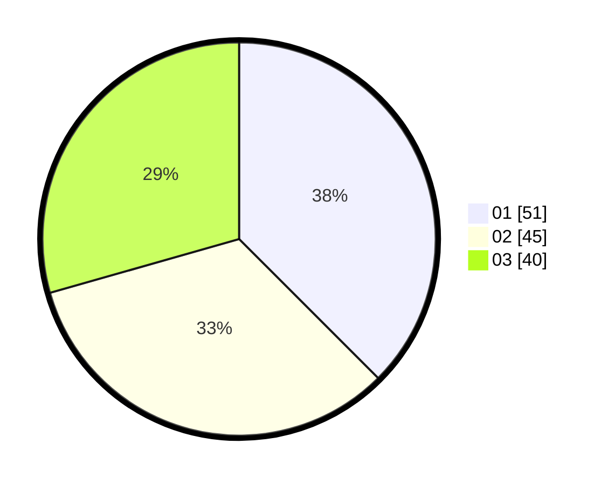

# Hasil

Hasil perolehan suara paslon dapat dilihat pada file paslon-01.txt, paslon-02.txt, dan paslon-03.txt.

Jika tidak ada, artinya data tersebut belum ada pada SIREKAP.

## Perolehan Suara

 * Paslon 01: **51**.
 * Paslon 02: **45**.
 * Paslon 03: **40**.

## Foto C Plano

https://sirekap-obj-formc.kpu.go.id/3cde/pemilu/ppwp/31/71/01/10/03/3171011003042-20240216-103010--4963f1b1-ad1b-4ca5-a2b8-42d754c03583.jpg

https://sirekap-obj-formc.kpu.go.id/3cde/pemilu/ppwp/31/71/01/10/03/3171011003042-20240216-103415--8e3561d6-840a-49cd-bd49-919fa0000b1b.jpg

https://sirekap-obj-formc.kpu.go.id/3cde/pemilu/ppwp/31/71/01/10/03/3171011003042-20240216-103125--80a50519-4c3f-4bb6-a431-a52ac96307a2.jpg

## DATA PEMILIH TETAP

Jumlah pemilih dalam DPT: **209**.
 * L: **106**.
 * P: **103**.

## DATA PENGGUNA HAK PILIH

Jumlah pengguna hak pilih dalam DPT: **129**.
 * L: **66**.
 * P: **63**.

Jumlah pengguna hak pilih dalam DPTb: **8**.
 * L: **3**.
 * P: **5**.

Jumlah pengguna hak pilih dalam DPK: **2**.
 * L: **0**.
 * P: **2**.

Jumlah pengguna hak pilih: **139**.
 * L: **69**.
 * P: **70**.

## JUMLAH SUARA SAH DAN TIDAK SAH

JUMLAH SELURUH SUARA SAH: **136**.

JUMLAH SUARA TIDAK SAH: **3**.

JUMLAH SELURUH SUARA SAH DAN SUARA TIDAK SAH: **139**.
