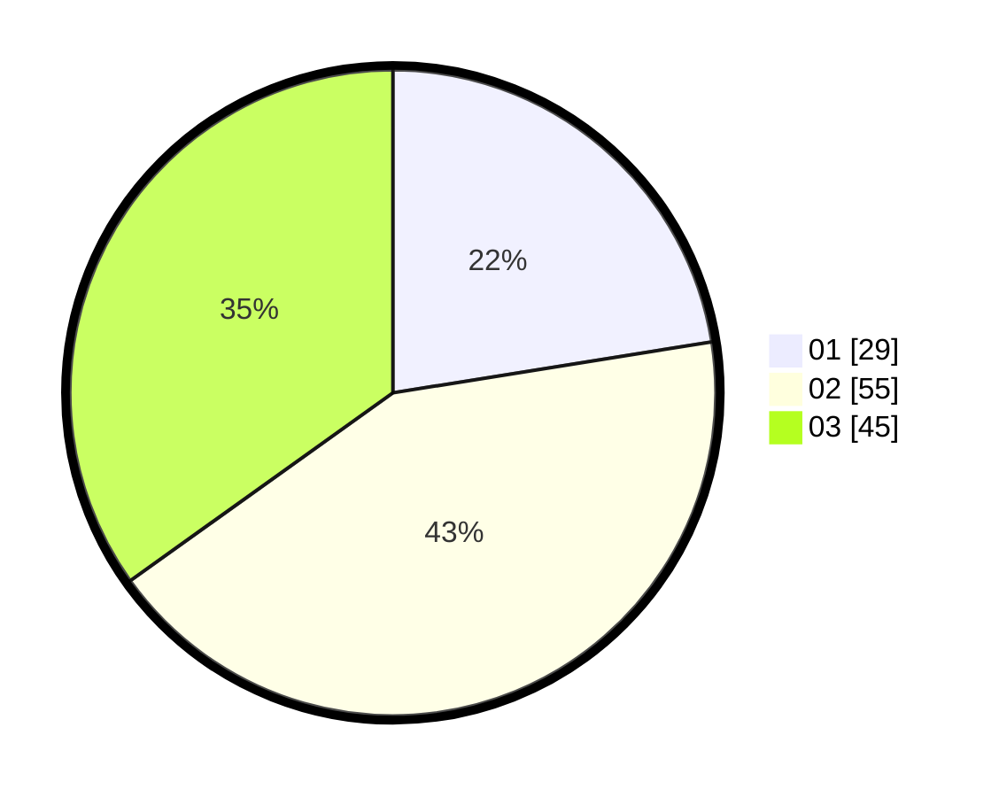

# Hasil

Hasil perolehan suara paslon dapat dilihat pada file paslon-01.txt, paslon-02.txt, dan paslon-03.txt.

Jika tidak ada, artinya data tersebut belum ada pada SIREKAP.

## Perolehan Suara

 * Paslon 01: **29**.
 * Paslon 02: **55**.
 * Paslon 03: **45**.

## Foto C Plano

https://sirekap-obj-formc.kpu.go.id/655e/pemilu/ppwp/31/71/01/10/03/3171011003043-20240214-155130--bb3472dc-d8f5-4378-96f6-883275e10848.jpg

https://sirekap-obj-formc.kpu.go.id/655e/pemilu/ppwp/31/71/01/10/03/3171011003043-20240214-155023--3594d8a0-0a2d-44f8-a85d-b6d30a2c46fb.jpg

https://sirekap-obj-formc.kpu.go.id/655e/pemilu/ppwp/31/71/01/10/03/3171011003043-20240214-155720--bdceb751-e26d-4c5a-87e3-fb0d2baaa68e.jpg

## DATA PEMILIH TETAP

Jumlah pemilih dalam DPT: **191**.
 * L: **96**.
 * P: **95**.

## DATA PENGGUNA HAK PILIH

Jumlah pengguna hak pilih dalam DPT: **127**.
 * L: **69**.
 * P: **58**.

Jumlah pengguna hak pilih dalam DPTb: **2**.
 * L: **1**.
 * P: **1**.

Jumlah pengguna hak pilih dalam DPK: **3**.
 * L: **1**.
 * P: **2**.

Jumlah pengguna hak pilih: **132**.
 * L: **71**.
 * P: **61**.

## JUMLAH SUARA SAH DAN TIDAK SAH

JUMLAH SELURUH SUARA SAH: **129**.

JUMLAH SUARA TIDAK SAH: **3**.

JUMLAH SELURUH SUARA SAH DAN SUARA TIDAK SAH: **132**.
