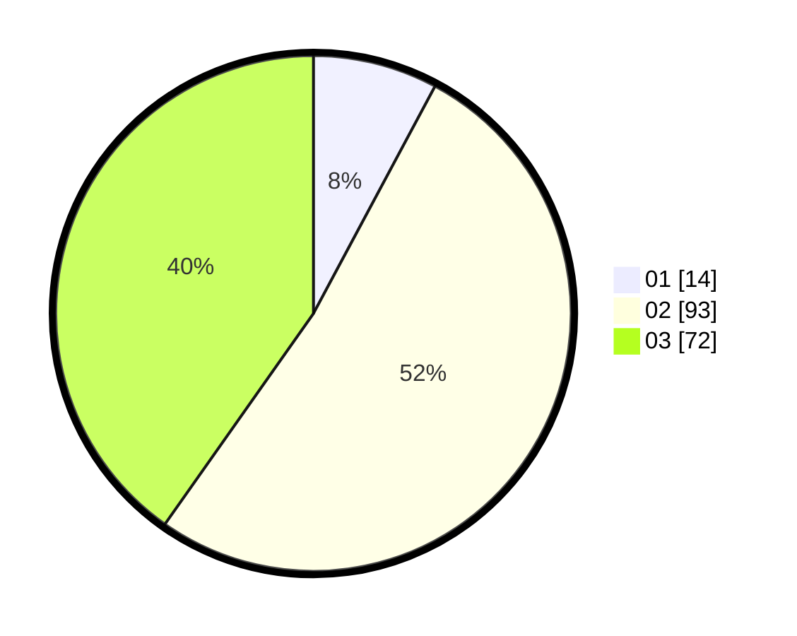

# Hasil

Hasil perolehan suara paslon dapat dilihat pada file paslon-01.txt, paslon-02.txt, dan paslon-03.txt.

Jika tidak ada, artinya data tersebut belum ada pada SIREKAP.

## Perolehan Suara

 * Paslon 01: **14**.
 * Paslon 02: **93**.
 * Paslon 03: **72**.

## Foto C Plano

https://sirekap-obj-formc.kpu.go.id/7afb/pemilu/ppwp/31/71/01/10/03/3171011003047-20240214-201043--1c65fdf5-3989-4448-bff7-b4724aa74eb4.jpg

https://sirekap-obj-formc.kpu.go.id/7afb/pemilu/ppwp/31/71/01/10/03/3171011003047-20240214-201050--c15cd4e7-e75b-489c-8651-93415acc8ec1.jpg

https://sirekap-obj-formc.kpu.go.id/7afb/pemilu/ppwp/31/71/01/10/03/3171011003047-20240214-201057--31eb1ce6-7e15-41e1-be72-5e9daf6ff49a.jpg

## DATA PEMILIH TETAP

Jumlah pemilih dalam DPT: **240**.
 * L: **115**.
 * P: **125**.

## DATA PENGGUNA HAK PILIH

Jumlah pengguna hak pilih dalam DPT: **167**.
 * L: **75**.
 * P: **92**.

Jumlah pengguna hak pilih dalam DPTb: **8**.
 * L: **4**.
 * P: **4**.

Jumlah pengguna hak pilih dalam DPK: **8**.
 * L: **2**.
 * P: **6**.

Jumlah pengguna hak pilih: **183**.
 * L: **81**.
 * P: **102**.

## JUMLAH SUARA SAH DAN TIDAK SAH

JUMLAH SELURUH SUARA SAH: **179**.

JUMLAH SUARA TIDAK SAH: **4**.

JUMLAH SELURUH SUARA SAH DAN SUARA TIDAK SAH: **183**.
