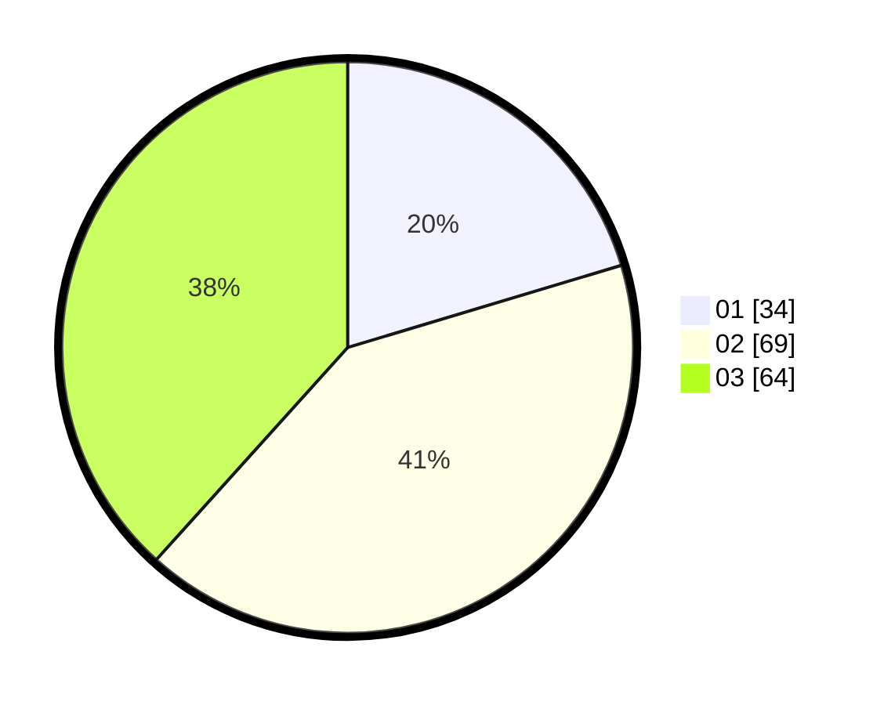

# Hasil

Hasil perolehan suara paslon dapat dilihat pada file paslon-01.txt, paslon-02.txt, dan paslon-03.txt.

Jika tidak ada, artinya data tersebut belum ada pada SIREKAP.

## Perolehan Suara

 * Paslon 01: **34**.
 * Paslon 02: **69**.
 * Paslon 03: **64**.

## Foto C Plano

https://sirekap-obj-formc.kpu.go.id/6581/pemilu/ppwp/31/71/01/10/03/3171011003048-20240215-010342--fb334f44-b8cd-4876-9f5a-15b1157b33b1.jpg

https://sirekap-obj-formc.kpu.go.id/6581/pemilu/ppwp/31/71/01/10/03/3171011003048-20240215-010413--9abca5ea-c1cf-4186-8147-6421d7d534c7.jpg

https://sirekap-obj-formc.kpu.go.id/6581/pemilu/ppwp/31/71/01/10/03/3171011003048-20240215-010442--6ed4a027-b157-4b32-9457-43a60a54e6e6.jpg

## DATA PEMILIH TETAP

Jumlah pemilih dalam DPT: **219**.
 * L: **108**.
 * P: **111**.

## DATA PENGGUNA HAK PILIH

Jumlah pengguna hak pilih dalam DPT: **154**.
 * L: **75**.
 * P: **79**.

Jumlah pengguna hak pilih dalam DPTb: **9**.
 * L: **6**.
 * P: **3**.

Jumlah pengguna hak pilih dalam DPK: **5**.
 * L: **2**.
 * P: **3**.

Jumlah pengguna hak pilih: **168**.
 * L: **83**.
 * P: **85**.

## JUMLAH SUARA SAH DAN TIDAK SAH

JUMLAH SELURUH SUARA SAH: **167**.

JUMLAH SUARA TIDAK SAH: **1**.

JUMLAH SELURUH SUARA SAH DAN SUARA TIDAK SAH: **168**.
