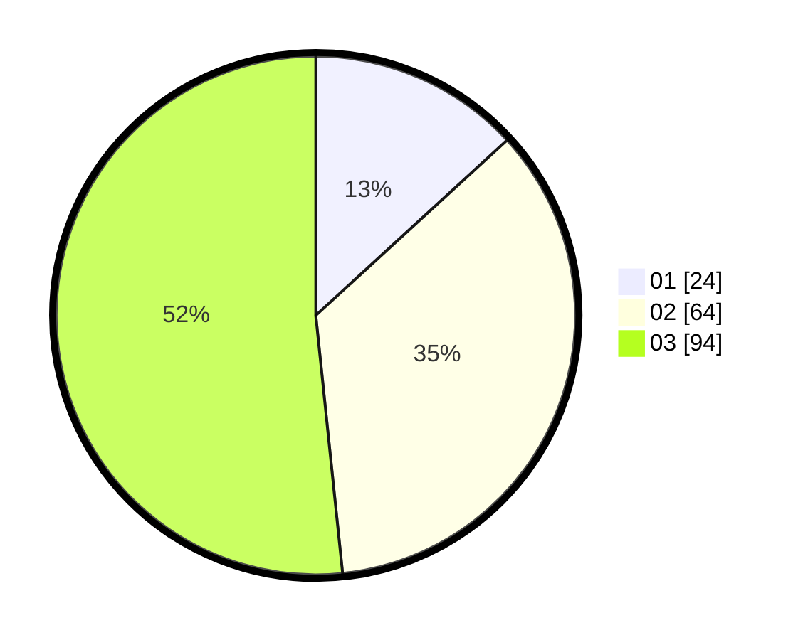

# Hasil

Hasil perolehan suara paslon dapat dilihat pada file paslon-01.txt, paslon-02.txt, dan paslon-03.txt.

Jika tidak ada, artinya data tersebut belum ada pada SIREKAP.

## Perolehan Suara

 * Paslon 01: **24**.
 * Paslon 02: **64**.
 * Paslon 03: **94**.

## Foto C Plano

https://sirekap-obj-formc.kpu.go.id/877e/pemilu/ppwp/31/71/01/10/03/3171011003050-20240216-062141--508b0995-5305-4cb9-a900-458c2f820ec2.jpg

https://sirekap-obj-formc.kpu.go.id/877e/pemilu/ppwp/31/71/01/10/03/3171011003050-20240216-062151--264d03fb-2fab-421b-9c15-f52977448b0b.jpg

https://sirekap-obj-formc.kpu.go.id/877e/pemilu/ppwp/31/71/01/10/03/3171011003050-20240216-062146--9cbecdb7-4af2-4c76-af4e-5dc8748a7182.jpg

## DATA PEMILIH TETAP

Jumlah pemilih dalam DPT: **188**.
 * L: **85**.
 * P: **103**.

## DATA PENGGUNA HAK PILIH

Jumlah pengguna hak pilih dalam DPT: **171**.
 * L: **78**.
 * P: **93**.

Jumlah pengguna hak pilih dalam DPTb: **10**.
 * L: **3**.
 * P: **7**.

Jumlah pengguna hak pilih dalam DPK: **7**.
 * L: **4**.
 * P: **3**.

Jumlah pengguna hak pilih: **188**.
 * L: **85**.
 * P: **103**.

## JUMLAH SUARA SAH DAN TIDAK SAH

JUMLAH SELURUH SUARA SAH: **182**.

JUMLAH SUARA TIDAK SAH: **6**.

JUMLAH SELURUH SUARA SAH DAN SUARA TIDAK SAH: **188**.
