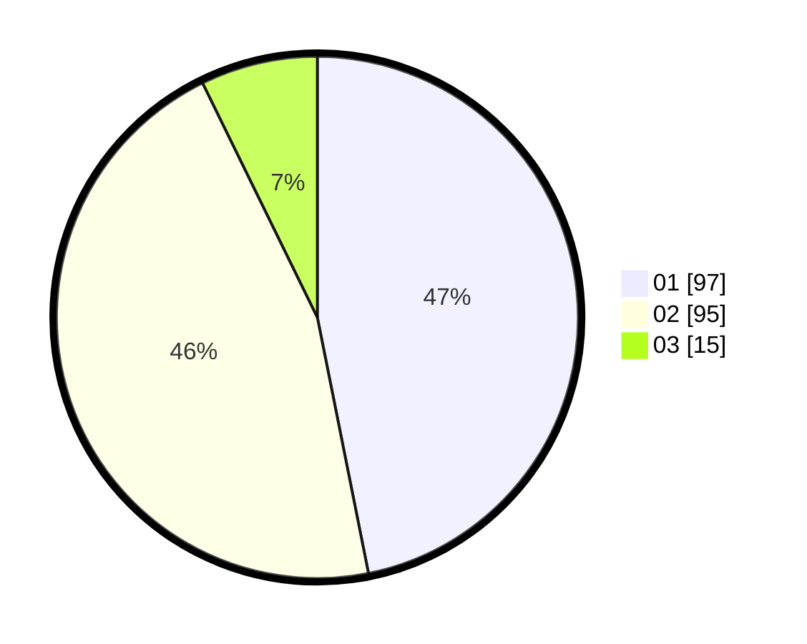

# Hasil

Hasil perolehan suara paslon dapat dilihat pada file paslon-01.txt, paslon-02.txt, dan paslon-03.txt.

Jika tidak ada, artinya data tersebut belum ada pada SIREKAP.

## Perolehan Suara

 * Paslon 01: **97**.
 * Paslon 02: **95**.
 * Paslon 03: **15**.

## Foto C Plano

https://sirekap-obj-formc.kpu.go.id/165a/pemilu/ppwp/31/71/01/10/03/3171011003052-20240214-231427--94cc8561-ce63-44d8-b015-dec7c97bc4b8.jpg

https://sirekap-obj-formc.kpu.go.id/165a/pemilu/ppwp/31/71/01/10/03/3171011003052-20240214-231523--466cbcef-1bf2-4373-ba80-07bec499046f.jpg

https://sirekap-obj-formc.kpu.go.id/165a/pemilu/ppwp/31/71/01/10/03/3171011003052-20240214-232420--72860d61-969d-48d2-958a-fcc8b46fce9e.jpg

## DATA PEMILIH TETAP

Jumlah pemilih dalam DPT: **259**.
 * L: **130**.
 * P: **129**.

## DATA PENGGUNA HAK PILIH

Jumlah pengguna hak pilih dalam DPT: **198**.
 * L: **98**.
 * P: **100**.

Jumlah pengguna hak pilih dalam DPTb: **8**.
 * L: **6**.
 * P: **2**.

Jumlah pengguna hak pilih dalam DPK: **4**.
 * L: **3**.
 * P: **1**.

Jumlah pengguna hak pilih: **210**.
 * L: **107**.
 * P: **103**.

## JUMLAH SUARA SAH DAN TIDAK SAH

JUMLAH SELURUH SUARA SAH: **207**.

JUMLAH SUARA TIDAK SAH: **3**.

JUMLAH SELURUH SUARA SAH DAN SUARA TIDAK SAH: **210**.
