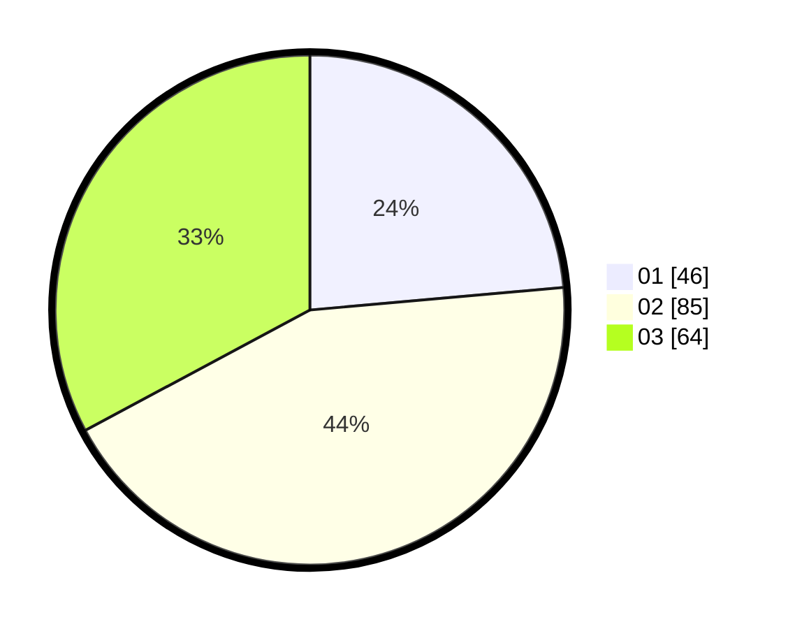

# Hasil

Hasil perolehan suara paslon dapat dilihat pada file paslon-01.txt, paslon-02.txt, dan paslon-03.txt.

Jika tidak ada, artinya data tersebut belum ada pada SIREKAP.

## Perolehan Suara

 * Paslon 01: **46**.
 * Paslon 02: **85**.
 * Paslon 03: **64**.

## Foto C Plano

https://sirekap-obj-formc.kpu.go.id/6fc2/pemilu/ppwp/31/71/01/10/03/3171011003053-20240214-204807--3724139d-d731-4379-aa84-41d4203a6243.jpg

https://sirekap-obj-formc.kpu.go.id/6fc2/pemilu/ppwp/31/71/01/10/03/3171011003053-20240214-205002--4f055308-ca7b-46a0-8621-2f38f0a35d2f.jpg

https://sirekap-obj-formc.kpu.go.id/6fc2/pemilu/ppwp/31/71/01/10/03/3171011003053-20240214-205137--75ccfdc9-7358-48db-b958-489dce09fc9f.jpg

## DATA PEMILIH TETAP

Jumlah pemilih dalam DPT: **186**.
 * L: **93**.
 * P: **93**.

## DATA PENGGUNA HAK PILIH

Jumlah pengguna hak pilih dalam DPT: **186**.
 * L: **93**.
 * P: **93**.

Jumlah pengguna hak pilih dalam DPTb: **7**.
 * L: **2**.
 * P: **5**.

Jumlah pengguna hak pilih dalam DPK: **5**.
 * L: **3**.
 * P: **2**.

Jumlah pengguna hak pilih: **198**.
 * L: **98**.
 * P: **100**.

## JUMLAH SUARA SAH DAN TIDAK SAH

JUMLAH SELURUH SUARA SAH: **195**.

JUMLAH SUARA TIDAK SAH: **3**.

JUMLAH SELURUH SUARA SAH DAN SUARA TIDAK SAH: **198**.
