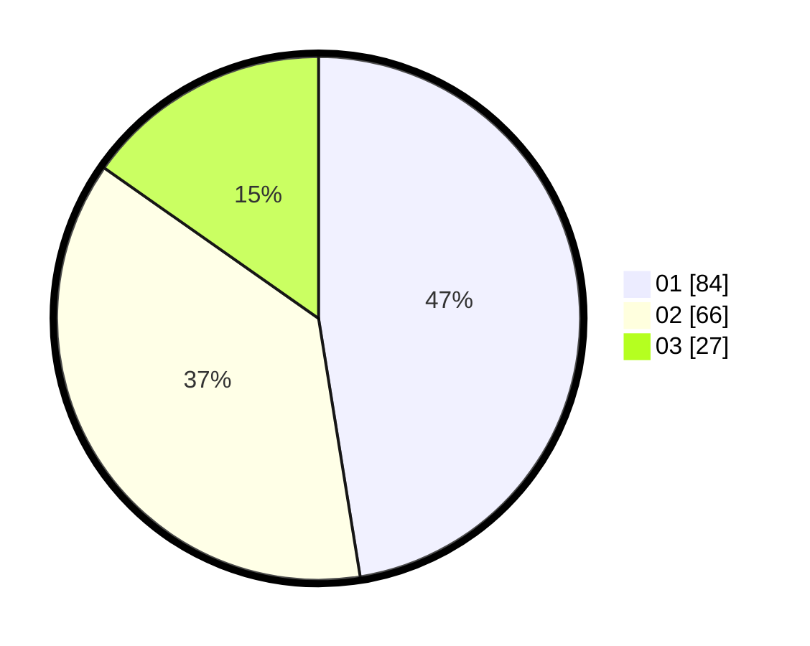

# Hasil

Hasil perolehan suara paslon dapat dilihat pada file paslon-01.txt, paslon-02.txt, dan paslon-03.txt.

Jika tidak ada, artinya data tersebut belum ada pada SIREKAP.

## Perolehan Suara

 * Paslon 01: **84**.
 * Paslon 02: **66**.
 * Paslon 03: **27**.

## Foto C Plano

https://sirekap-obj-formc.kpu.go.id/4cc6/pemilu/ppwp/31/71/01/10/03/3171011003058-20240215-010415--83417e0b-b016-48d2-a8e2-a31ab2335f37.jpg

https://sirekap-obj-formc.kpu.go.id/4cc6/pemilu/ppwp/31/71/01/10/03/3171011003058-20240215-010507--ab1ea8f4-2499-4c71-b3e0-559bc95dcce7.jpg
