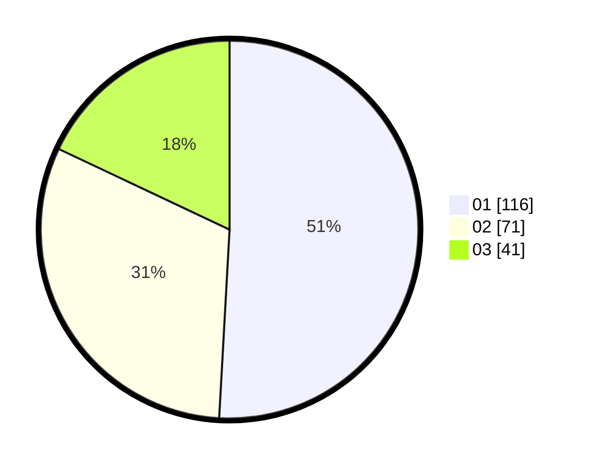

# Hasil

Hasil perolehan suara paslon dapat dilihat pada file paslon-01.txt, paslon-02.txt, dan paslon-03.txt.

Jika tidak ada, artinya data tersebut belum ada pada SIREKAP.

## Perolehan Suara

 * Paslon 01: **116**.
 * Paslon 02: **71**.
 * Paslon 03: **41**.

## Foto C Plano

https://sirekap-obj-formc.kpu.go.id/baef/pemilu/ppwp/31/71/01/10/04/3171011004003-20240216-021614--2ad84808-36cf-49c3-b930-1456f6a6d69d.jpg

https://sirekap-obj-formc.kpu.go.id/baef/pemilu/ppwp/31/71/01/10/04/3171011004003-20240216-021615--40397189-54b7-4eb8-8b6b-0c5ce92e8cc1.jpg

https://sirekap-obj-formc.kpu.go.id/baef/pemilu/ppwp/31/71/01/10/04/3171011004003-20240216-021614--f81ce0e4-e93e-4ee1-8e0c-ba9a6c53f98a.jpg

## DATA PEMILIH TETAP

Jumlah pemilih dalam DPT: **279**.
 * L: **144**.
 * P: **135**.

## DATA PENGGUNA HAK PILIH

Jumlah pengguna hak pilih dalam DPT: **217**.
 * L: **107**.
 * P: **110**.

Jumlah pengguna hak pilih dalam DPTb: **12**.
 * L: **7**.
 * P: **5**.

Jumlah pengguna hak pilih dalam DPK: **3**.
 * L: **2**.
 * P: **1**.

Jumlah pengguna hak pilih: **232**.
 * L: **116**.
 * P: **116**.

## JUMLAH SUARA SAH DAN TIDAK SAH

JUMLAH SELURUH SUARA SAH: **228**.

JUMLAH SUARA TIDAK SAH: **4**.

JUMLAH SELURUH SUARA SAH DAN SUARA TIDAK SAH: **232**.
