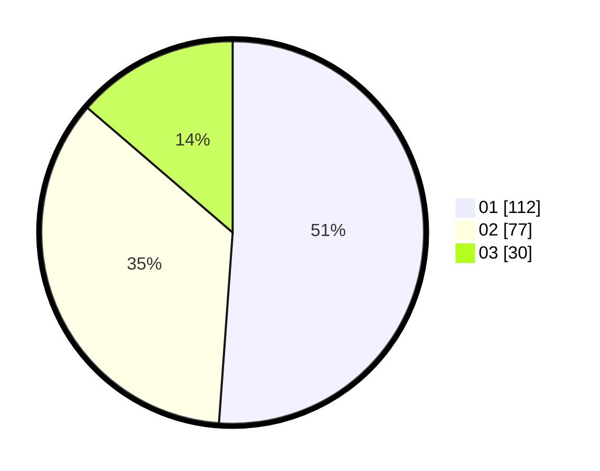

# Hasil

Hasil perolehan suara paslon dapat dilihat pada file paslon-01.txt, paslon-02.txt, dan paslon-03.txt.

Jika tidak ada, artinya data tersebut belum ada pada SIREKAP.

## Perolehan Suara

 * Paslon 01: **112**.
 * Paslon 02: **77**.
 * Paslon 03: **30**.

## Foto C Plano

https://sirekap-obj-formc.kpu.go.id/855c/pemilu/ppwp/31/71/01/10/04/3171011004004-20240215-231045--f3fc1126-518b-4f33-91d1-94493823596e.jpg

https://sirekap-obj-formc.kpu.go.id/855c/pemilu/ppwp/31/71/01/10/04/3171011004004-20240215-231048--80f98be1-97a5-4d28-a742-5b9481e5fb44.jpg

https://sirekap-obj-formc.kpu.go.id/855c/pemilu/ppwp/31/71/01/10/04/3171011004004-20240215-231047--fe47d3cf-e3d3-4ebb-b7fb-186ca2ad8e82.jpg

## DATA PEMILIH TETAP

Jumlah pemilih dalam DPT: **269**.
 * L: **121**.
 * P: **148**.

## DATA PENGGUNA HAK PILIH

Jumlah pengguna hak pilih dalam DPT: **205**.
 * L: **87**.
 * P: **118**.

Jumlah pengguna hak pilih dalam DPTb: **14**.
 * L: **6**.
 * P: **8**.

Jumlah pengguna hak pilih dalam DPK: **2**.
 * L: **1**.
 * P: **1**.

Jumlah pengguna hak pilih: **221**.
 * L: **94**.
 * P: **127**.

## JUMLAH SUARA SAH DAN TIDAK SAH

JUMLAH SELURUH SUARA SAH: **219**.

JUMLAH SUARA TIDAK SAH: **2**.

JUMLAH SELURUH SUARA SAH DAN SUARA TIDAK SAH: **221**.
