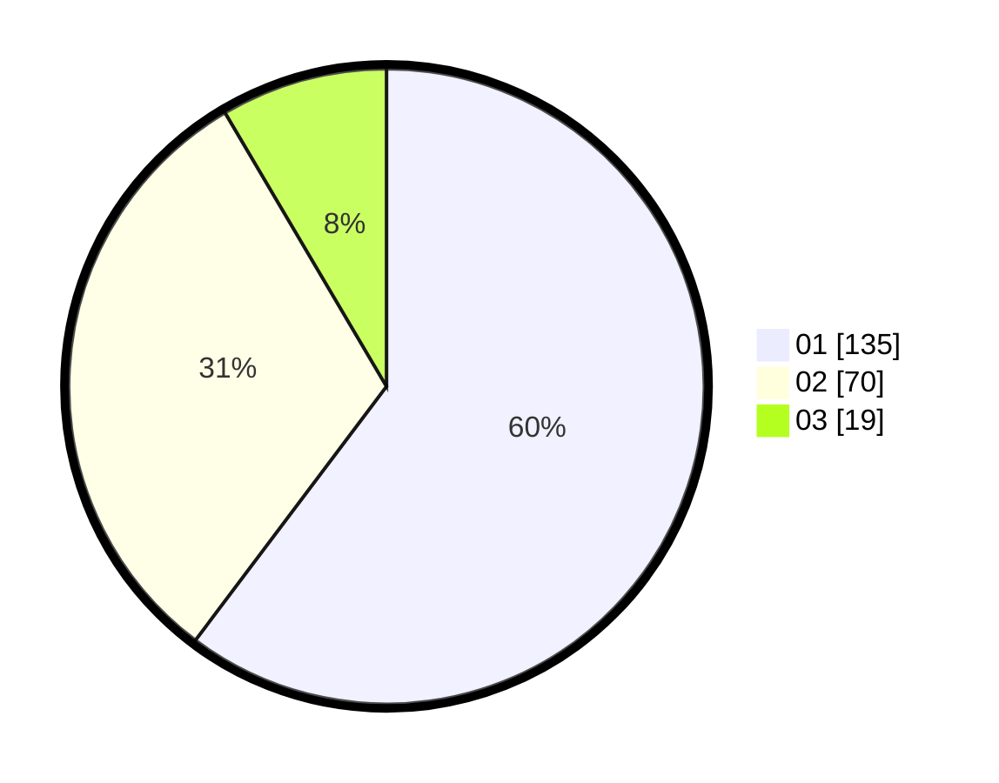

# Hasil

Hasil perolehan suara paslon dapat dilihat pada file paslon-01.txt, paslon-02.txt, dan paslon-03.txt.

Jika tidak ada, artinya data tersebut belum ada pada SIREKAP.

## Perolehan Suara

 * Paslon 01: **135**.
 * Paslon 02: **70**.
 * Paslon 03: **19**.

## Foto C Plano

https://sirekap-obj-formc.kpu.go.id/0eda/pemilu/ppwp/31/71/01/10/04/3171011004005-20240214-175324--be661838-26a2-4d5f-b0e9-12f5ee4725cb.jpg

https://sirekap-obj-formc.kpu.go.id/0eda/pemilu/ppwp/31/71/01/10/04/3171011004005-20240216-124425--8becbe00-fe4e-46ef-85b7-b259b6aa1707.jpg

https://sirekap-obj-formc.kpu.go.id/0eda/pemilu/ppwp/31/71/01/10/04/3171011004005-20240216-124425--4e270a1e-79a8-46cc-bc77-40190a466ac8.jpg

## DATA PEMILIH TETAP

Jumlah pemilih dalam DPT: **266**.
 * L: **135**.
 * P: **131**.

## DATA PENGGUNA HAK PILIH

Jumlah pengguna hak pilih dalam DPT: **210**.
 * L: **105**.
 * P: **105**.

Jumlah pengguna hak pilih dalam DPTb: **13**.
 * L: **8**.
 * P: **5**.

Jumlah pengguna hak pilih dalam DPK: **3**.
 * L: **2**.
 * P: **1**.

Jumlah pengguna hak pilih: **226**.
 * L: **115**.
 * P: **111**.

## JUMLAH SUARA SAH DAN TIDAK SAH

JUMLAH SELURUH SUARA SAH: **224**.

JUMLAH SUARA TIDAK SAH: **2**.

JUMLAH SELURUH SUARA SAH DAN SUARA TIDAK SAH: **226**.
