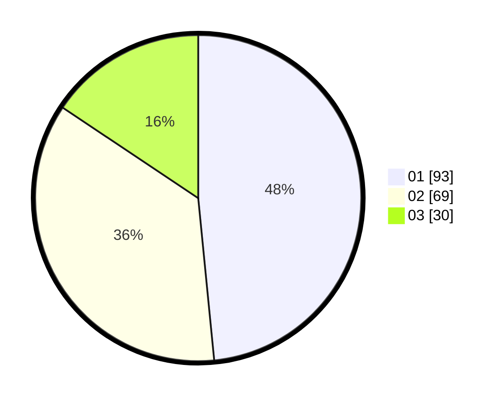

# Hasil

Hasil perolehan suara paslon dapat dilihat pada file paslon-01.txt, paslon-02.txt, dan paslon-03.txt.

Jika tidak ada, artinya data tersebut belum ada pada SIREKAP.

## Perolehan Suara

 * Paslon 01: **93**.
 * Paslon 02: **69**.
 * Paslon 03: **30**.

## Foto C Plano

https://sirekap-obj-formc.kpu.go.id/11ee/pemilu/ppwp/31/71/01/10/04/3171011004006-20240216-031253--5ab288dc-6d97-4faf-b7c1-4bbfe936b136.jpg

https://sirekap-obj-formc.kpu.go.id/11ee/pemilu/ppwp/31/71/01/10/04/3171011004006-20240216-031305--e8da3611-dc3d-4293-a1d2-0d52b5f7ab47.jpg

https://sirekap-obj-formc.kpu.go.id/11ee/pemilu/ppwp/31/71/01/10/04/3171011004006-20240216-031300--9e91307a-44d9-4019-a379-ca13fe4f26cf.jpg

## DATA PEMILIH TETAP

Jumlah pemilih dalam DPT: **255**.
 * L: **137**.
 * P: **118**.

## DATA PENGGUNA HAK PILIH

Jumlah pengguna hak pilih dalam DPT: **183**.
 * L: **100**.
 * P: **83**.

Jumlah pengguna hak pilih dalam DPTb: **12**.
 * L: **3**.
 * P: **9**.

Jumlah pengguna hak pilih dalam DPK: **0**.
 * L: **0**.
 * P: **0**.

Jumlah pengguna hak pilih: **195**.
 * L: **103**.
 * P: **92**.

## JUMLAH SUARA SAH DAN TIDAK SAH

JUMLAH SELURUH SUARA SAH: **192**.

JUMLAH SUARA TIDAK SAH: **3**.

JUMLAH SELURUH SUARA SAH DAN SUARA TIDAK SAH: **195**.
