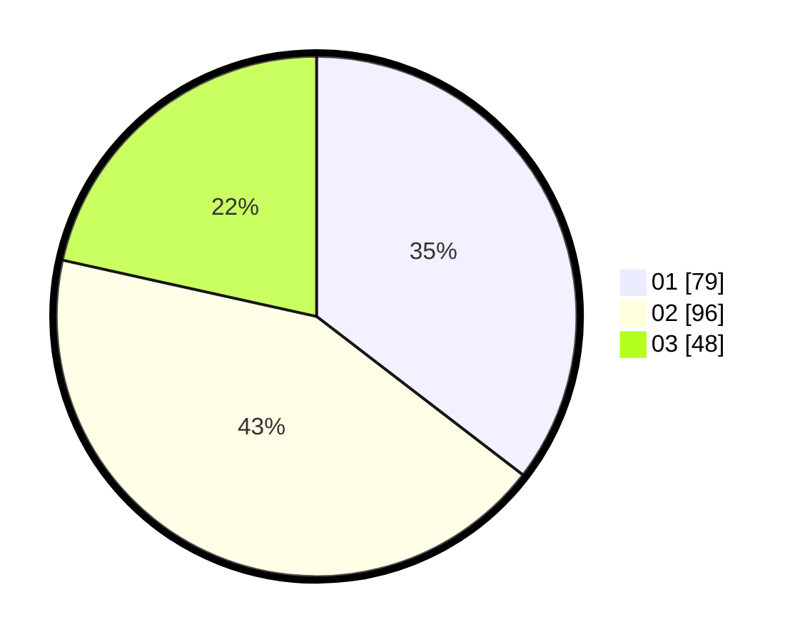

# Hasil

Hasil perolehan suara paslon dapat dilihat pada file paslon-01.txt, paslon-02.txt, dan paslon-03.txt.

Jika tidak ada, artinya data tersebut belum ada pada SIREKAP.

## Perolehan Suara

 * Paslon 01: **79**.
 * Paslon 02: **96**.
 * Paslon 03: **48**.

## Foto C Plano

https://sirekap-obj-formc.kpu.go.id/873d/pemilu/ppwp/31/71/01/10/04/3171011004008-20240214-155658--764ea3bb-7131-488d-9536-db94f399b5be.jpg

https://sirekap-obj-formc.kpu.go.id/873d/pemilu/ppwp/31/71/01/10/04/3171011004008-20240214-155905--eb2c0228-beb9-4169-89f3-f0348d85ea58.jpg

https://sirekap-obj-formc.kpu.go.id/873d/pemilu/ppwp/31/71/01/10/04/3171011004008-20240214-160056--2953566c-beef-436f-b349-974cf7ac60ee.jpg

## DATA PEMILIH TETAP

Jumlah pemilih dalam DPT: **278**.
 * L: **138**.
 * P: **140**.

## DATA PENGGUNA HAK PILIH

Jumlah pengguna hak pilih dalam DPT: **200**.
 * L: **92**.
 * P: **108**.

Jumlah pengguna hak pilih dalam DPTb: **17**.
 * L: **1**.
 * P: **16**.

Jumlah pengguna hak pilih dalam DPK: **9**.
 * L: **6**.
 * P: **3**.

Jumlah pengguna hak pilih: **226**.
 * L: **99**.
 * P: **127**.

## JUMLAH SUARA SAH DAN TIDAK SAH

JUMLAH SELURUH SUARA SAH: **223**.

JUMLAH SUARA TIDAK SAH: **3**.

JUMLAH SELURUH SUARA SAH DAN SUARA TIDAK SAH: **226**.
