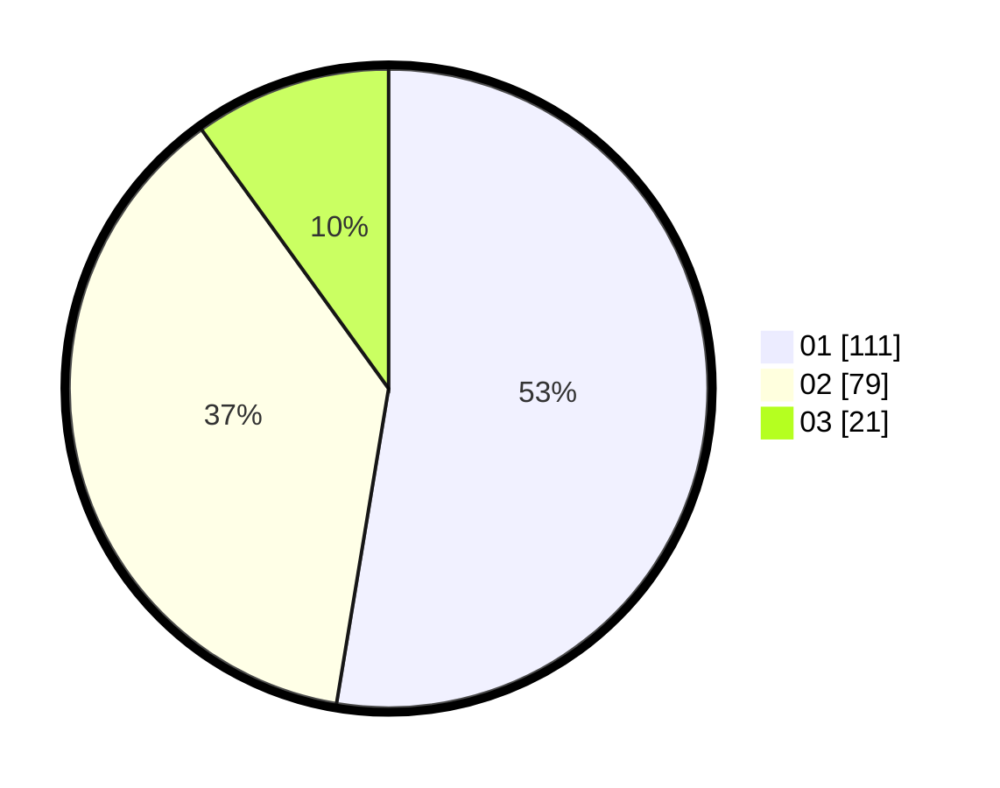

# Hasil

Hasil perolehan suara paslon dapat dilihat pada file paslon-01.txt, paslon-02.txt, dan paslon-03.txt.

Jika tidak ada, artinya data tersebut belum ada pada SIREKAP.

## Perolehan Suara

 * Paslon 01: **111**.
 * Paslon 02: **79**.
 * Paslon 03: **21**.

## Foto C Plano

https://sirekap-obj-formc.kpu.go.id/75bd/pemilu/ppwp/31/71/01/10/04/3171011004010-20240215-002007--d1f19e00-a73e-4e89-835a-1a9218e1b61b.jpg

https://sirekap-obj-formc.kpu.go.id/75bd/pemilu/ppwp/31/71/01/10/04/3171011004010-20240215-002024--7e0826b0-9d29-4c70-bf14-fe52b397d036.jpg
