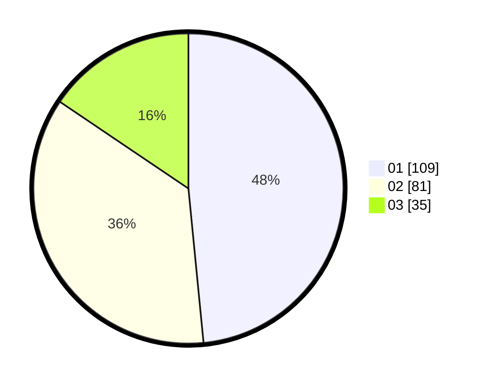

# Hasil

Hasil perolehan suara paslon dapat dilihat pada file paslon-01.txt, paslon-02.txt, dan paslon-03.txt.

Jika tidak ada, artinya data tersebut belum ada pada SIREKAP.

## Perolehan Suara

 * Paslon 01: **109**.
 * Paslon 02: **81**.
 * Paslon 03: **35**.

## Foto C Plano

https://sirekap-obj-formc.kpu.go.id/91e2/pemilu/ppwp/31/71/01/10/04/3171011004012-20240215-000849--90cc9c69-3c5a-447c-8089-69323ce91af0.jpg

https://sirekap-obj-formc.kpu.go.id/91e2/pemilu/ppwp/31/71/01/10/04/3171011004012-20240215-001021--78d5be0d-cb1e-4ec8-be5a-5fef0737f69f.jpg

https://sirekap-obj-formc.kpu.go.id/91e2/pemilu/ppwp/31/71/01/10/04/3171011004012-20240215-001121--83d36420-a990-4f43-8675-873656230061.jpg

## DATA PEMILIH TETAP

Jumlah pemilih dalam DPT: **279**.
 * L: **142**.
 * P: **137**.

## DATA PENGGUNA HAK PILIH

Jumlah pengguna hak pilih dalam DPT: **198**.
 * L: **100**.
 * P: **98**.

Jumlah pengguna hak pilih dalam DPTb: **17**.
 * L: **8**.
 * P: **9**.

Jumlah pengguna hak pilih dalam DPK: **11**.
 * L: **5**.
 * P: **6**.

Jumlah pengguna hak pilih: **226**.
 * L: **113**.
 * P: **113**.

## JUMLAH SUARA SAH DAN TIDAK SAH

JUMLAH SELURUH SUARA SAH: **225**.

JUMLAH SUARA TIDAK SAH: **1**.

JUMLAH SELURUH SUARA SAH DAN SUARA TIDAK SAH: **226**.
