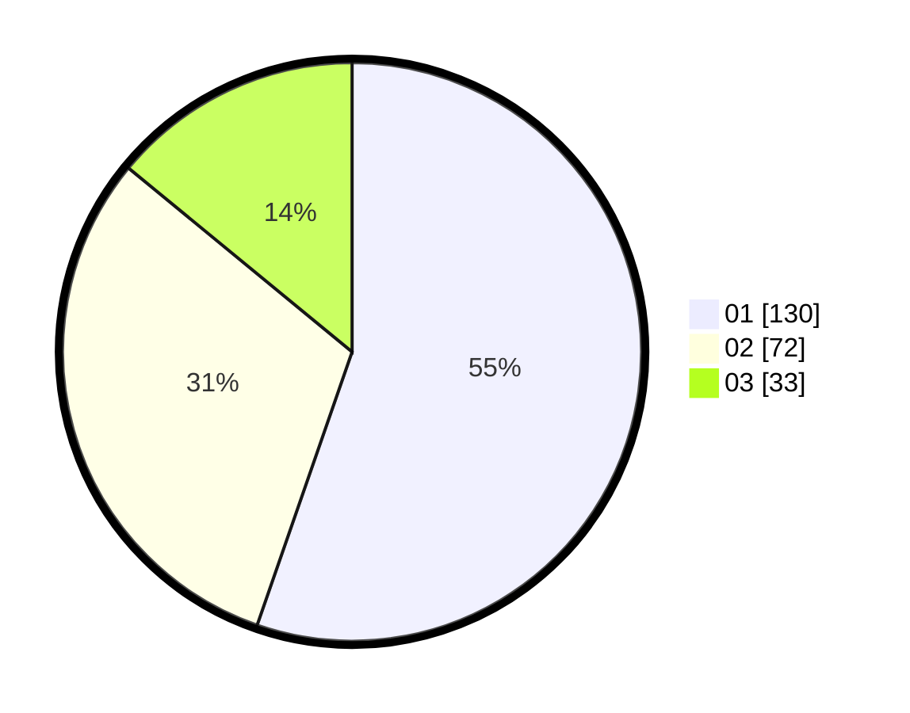

# Hasil

Hasil perolehan suara paslon dapat dilihat pada file paslon-01.txt, paslon-02.txt, dan paslon-03.txt.

Jika tidak ada, artinya data tersebut belum ada pada SIREKAP.

## Perolehan Suara

 * Paslon 01: **130**.
 * Paslon 02: **72**.
 * Paslon 03: **33**.

## Foto C Plano

https://sirekap-obj-formc.kpu.go.id/9f5a/pemilu/ppwp/31/71/01/10/04/3171011004017-20240216-220821--18cfef46-f794-457e-a8a6-80c1fa250360.jpg

https://sirekap-obj-formc.kpu.go.id/9f5a/pemilu/ppwp/31/71/01/10/04/3171011004017-20240216-220822--ed703737-c675-4f8a-86af-4f0cedd90016.jpg

https://sirekap-obj-formc.kpu.go.id/9f5a/pemilu/ppwp/31/71/01/10/04/3171011004017-20240216-220822--ac9040e2-87f0-405e-afb3-4170158237da.jpg

## DATA PEMILIH TETAP

Jumlah pemilih dalam DPT: **270**.
 * L: **134**.
 * P: **136**.

## DATA PENGGUNA HAK PILIH

Jumlah pengguna hak pilih dalam DPT: **222**.
 * L: **106**.
 * P: **116**.

Jumlah pengguna hak pilih dalam DPTb: **16**.
 * L: **5**.
 * P: **11**.

Jumlah pengguna hak pilih dalam DPK: **1**.
 * L: **0**.
 * P: **1**.

Jumlah pengguna hak pilih: **239**.
 * L: **111**.
 * P: **128**.

## JUMLAH SUARA SAH DAN TIDAK SAH

JUMLAH SELURUH SUARA SAH: **235**.

JUMLAH SUARA TIDAK SAH: **4**.

JUMLAH SELURUH SUARA SAH DAN SUARA TIDAK SAH: **239**.
