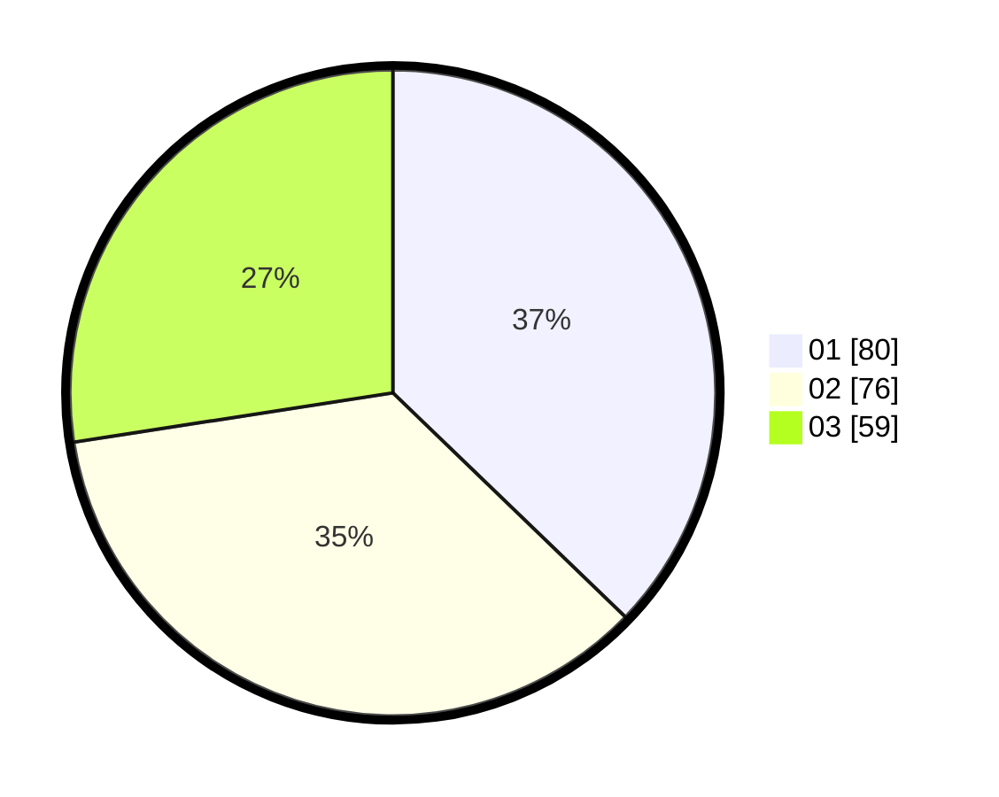

# Hasil

Hasil perolehan suara paslon dapat dilihat pada file paslon-01.txt, paslon-02.txt, dan paslon-03.txt.

Jika tidak ada, artinya data tersebut belum ada pada SIREKAP.

## Perolehan Suara

 * Paslon 01: **80**.
 * Paslon 02: **76**.
 * Paslon 03: **59**.

## Foto C Plano

https://sirekap-obj-formc.kpu.go.id/e67d/pemilu/ppwp/31/71/01/10/04/3171011004018-20240216-164842--df07888f-85b4-4e73-ad4e-d4c86461df64.jpg

https://sirekap-obj-formc.kpu.go.id/e67d/pemilu/ppwp/31/71/01/10/04/3171011004018-20240216-164843--d8527be2-abf3-4405-8fcb-7a71063bbefc.jpg

https://sirekap-obj-formc.kpu.go.id/e67d/pemilu/ppwp/31/71/01/10/04/3171011004018-20240216-164843--51438d1f-f7d4-48dd-b2fb-727c602a37dd.jpg

## DATA PEMILIH TETAP

Jumlah pemilih dalam DPT: **272**.
 * L: **126**.
 * P: **146**.

## DATA PENGGUNA HAK PILIH

Jumlah pengguna hak pilih dalam DPT: **201**.
 * L: **97**.
 * P: **104**.

Jumlah pengguna hak pilih dalam DPTb: **14**.
 * L: **4**.
 * P: **10**.

Jumlah pengguna hak pilih dalam DPK: **4**.
 * L: **4**.
 * P: **0**.

Jumlah pengguna hak pilih: **219**.
 * L: **105**.
 * P: **114**.

## JUMLAH SUARA SAH DAN TIDAK SAH

JUMLAH SELURUH SUARA SAH: **215**.

JUMLAH SUARA TIDAK SAH: **4**.

JUMLAH SELURUH SUARA SAH DAN SUARA TIDAK SAH: **219**.
