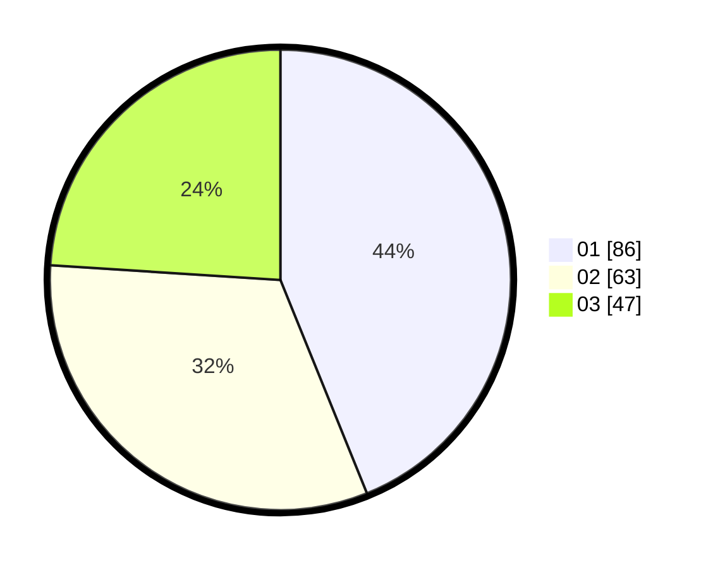

# Hasil

Hasil perolehan suara paslon dapat dilihat pada file paslon-01.txt, paslon-02.txt, dan paslon-03.txt.

Jika tidak ada, artinya data tersebut belum ada pada SIREKAP.

## Perolehan Suara

 * Paslon 01: **86**.
 * Paslon 02: **63**.
 * Paslon 03: **47**.

## Foto C Plano

https://sirekap-obj-formc.kpu.go.id/7532/pemilu/ppwp/31/71/01/10/04/3171011004019-20240214-224731--99230bd8-d9f3-4143-9548-7d991e792825.jpg

https://sirekap-obj-formc.kpu.go.id/7532/pemilu/ppwp/31/71/01/10/04/3171011004019-20240214-224959--9c587e11-8e7a-4c39-b94c-4b3d2921ac9a.jpg

https://sirekap-obj-formc.kpu.go.id/7532/pemilu/ppwp/31/71/01/10/04/3171011004019-20240214-225154--396f4e1a-8516-4ed6-a690-6dfb732135d9.jpg

## DATA PEMILIH TETAP

Jumlah pemilih dalam DPT: **272**.
 * L: **136**.
 * P: **136**.

## DATA PENGGUNA HAK PILIH

Jumlah pengguna hak pilih dalam DPT: **172**.
 * L: **87**.
 * P: **85**.

Jumlah pengguna hak pilih dalam DPTb: **20**.
 * L: **10**.
 * P: **10**.

Jumlah pengguna hak pilih dalam DPK: **7**.
 * L: **2**.
 * P: **5**.

Jumlah pengguna hak pilih: **199**.
 * L: **99**.
 * P: **100**.

## JUMLAH SUARA SAH DAN TIDAK SAH

JUMLAH SELURUH SUARA SAH: **196**.

JUMLAH SUARA TIDAK SAH: **3**.

JUMLAH SELURUH SUARA SAH DAN SUARA TIDAK SAH: **199**.
