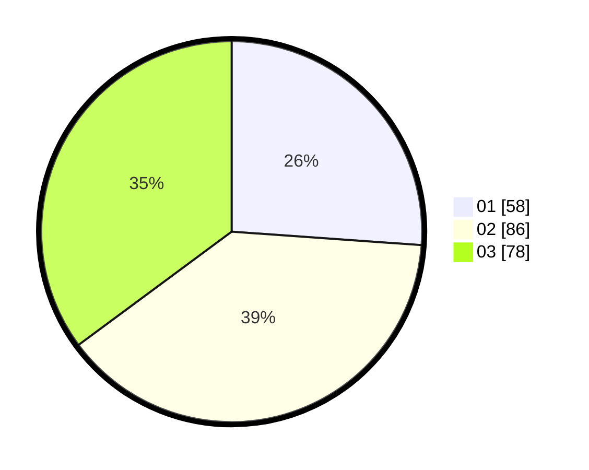

# Hasil

Hasil perolehan suara paslon dapat dilihat pada file paslon-01.txt, paslon-02.txt, dan paslon-03.txt.

Jika tidak ada, artinya data tersebut belum ada pada SIREKAP.

## Perolehan Suara

 * Paslon 01: **58**.
 * Paslon 02: **86**.
 * Paslon 03: **78**.

## Foto C Plano

https://sirekap-obj-formc.kpu.go.id/19c6/pemilu/ppwp/31/71/01/10/04/3171011004022-20240215-210144--15258176-23e9-4b60-a399-29d092598519.jpg

https://sirekap-obj-formc.kpu.go.id/19c6/pemilu/ppwp/31/71/01/10/04/3171011004022-20240215-210351--ce506600-baf6-4b0c-98b7-5757d6181a34.jpg

https://sirekap-obj-formc.kpu.go.id/19c6/pemilu/ppwp/31/71/01/10/04/3171011004022-20240215-210521--22520512-7cc5-45b6-a595-d65f0452d74e.jpg

## DATA PEMILIH TETAP

Jumlah pemilih dalam DPT: **271**.
 * L: **127**.
 * P: **144**.

## DATA PENGGUNA HAK PILIH

Jumlah pengguna hak pilih dalam DPT: **208**.
 * L: **94**.
 * P: **114**.

Jumlah pengguna hak pilih dalam DPTb: **16**.
 * L: **10**.
 * P: **6**.

Jumlah pengguna hak pilih dalam DPK: **1**.
 * L: **1**.
 * P: **0**.

Jumlah pengguna hak pilih: **225**.
 * L: **105**.
 * P: **120**.

## JUMLAH SUARA SAH DAN TIDAK SAH

JUMLAH SELURUH SUARA SAH: **222**.

JUMLAH SUARA TIDAK SAH: **3**.

JUMLAH SELURUH SUARA SAH DAN SUARA TIDAK SAH: **225**.
