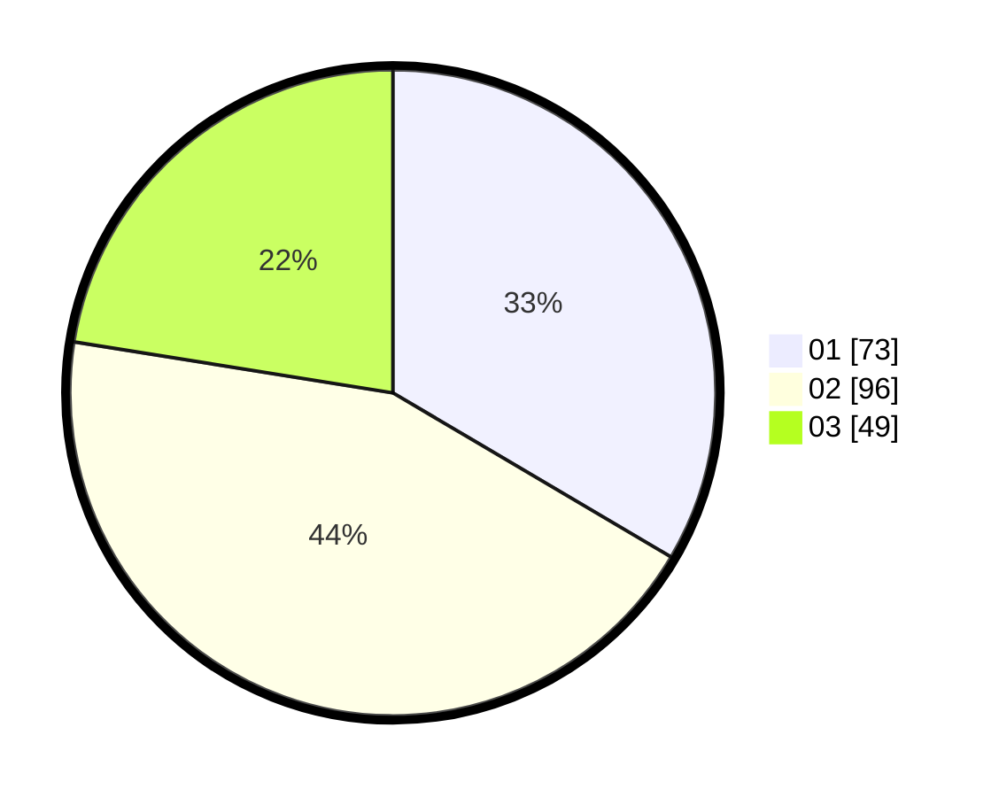

# Hasil

Hasil perolehan suara paslon dapat dilihat pada file paslon-01.txt, paslon-02.txt, dan paslon-03.txt.

Jika tidak ada, artinya data tersebut belum ada pada SIREKAP.

## Perolehan Suara

 * Paslon 01: **73**.
 * Paslon 02: **96**.
 * Paslon 03: **49**.

## Foto C Plano

https://sirekap-obj-formc.kpu.go.id/6be7/pemilu/ppwp/31/71/01/10/04/3171011004023-20240214-233211--6b53e52e-a145-4cec-a265-d27408b54562.jpg

https://sirekap-obj-formc.kpu.go.id/6be7/pemilu/ppwp/31/71/01/10/04/3171011004023-20240214-233237--50e68392-11f1-4586-bd2b-d7dc0abb32e5.jpg

https://sirekap-obj-formc.kpu.go.id/6be7/pemilu/ppwp/31/71/01/10/04/3171011004023-20240214-233309--4f830393-549b-4ff9-b3fc-8fee6abd541f.jpg

## DATA PEMILIH TETAP

Jumlah pemilih dalam DPT: **202**.
 * L: **104**.
 * P: **98**.

## DATA PENGGUNA HAK PILIH

Jumlah pengguna hak pilih dalam DPT: **202**.
 * L: **104**.
 * P: **98**.

Jumlah pengguna hak pilih dalam DPTb: **14**.
 * L: **10**.
 * P: **4**.

Jumlah pengguna hak pilih dalam DPK: **2**.
 * L: **1**.
 * P: **1**.

Jumlah pengguna hak pilih: **218**.
 * L: **115**.
 * P: **103**.

## JUMLAH SUARA SAH DAN TIDAK SAH

JUMLAH SELURUH SUARA SAH: **0**.

JUMLAH SUARA TIDAK SAH: **0**.

JUMLAH SELURUH SUARA SAH DAN SUARA TIDAK SAH: **0**.
