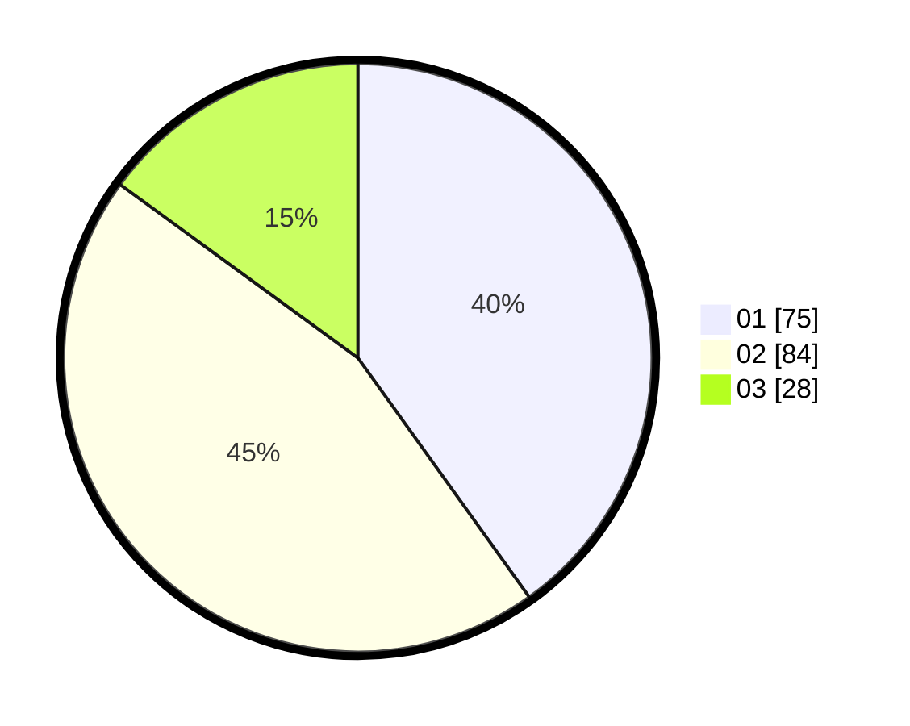

# Hasil

Hasil perolehan suara paslon dapat dilihat pada file paslon-01.txt, paslon-02.txt, dan paslon-03.txt.

Jika tidak ada, artinya data tersebut belum ada pada SIREKAP.

## Perolehan Suara

 * Paslon 01: **75**.
 * Paslon 02: **84**.
 * Paslon 03: **28**.

## Foto C Plano

https://sirekap-obj-formc.kpu.go.id/3d3b/pemilu/ppwp/31/71/01/10/04/3171011004024-20240216-165002--d463aa79-3a0f-4928-82a8-67e2081e2f8f.jpg

https://sirekap-obj-formc.kpu.go.id/3d3b/pemilu/ppwp/31/71/01/10/04/3171011004024-20240216-165003--a6322ec9-3add-4bf7-aebe-b5ef745d4f48.jpg

https://sirekap-obj-formc.kpu.go.id/3d3b/pemilu/ppwp/31/71/01/10/04/3171011004024-20240216-165003--deb2723c-a6d3-4f54-bb8b-2afcb62d6b03.jpg

## DATA PEMILIH TETAP

Jumlah pemilih dalam DPT: **279**.
 * L: **144**.
 * P: **135**.

## DATA PENGGUNA HAK PILIH

Jumlah pengguna hak pilih dalam DPT: **172**.
 * L: **90**.
 * P: **82**.

Jumlah pengguna hak pilih dalam DPTb: **15**.
 * L: **10**.
 * P: **5**.

Jumlah pengguna hak pilih dalam DPK: **0**.
 * L: **0**.
 * P: **0**.

Jumlah pengguna hak pilih: **187**.
 * L: **100**.
 * P: **87**.

## JUMLAH SUARA SAH DAN TIDAK SAH

JUMLAH SELURUH SUARA SAH: **187**.

JUMLAH SUARA TIDAK SAH: **0**.

JUMLAH SELURUH SUARA SAH DAN SUARA TIDAK SAH: **187**.
