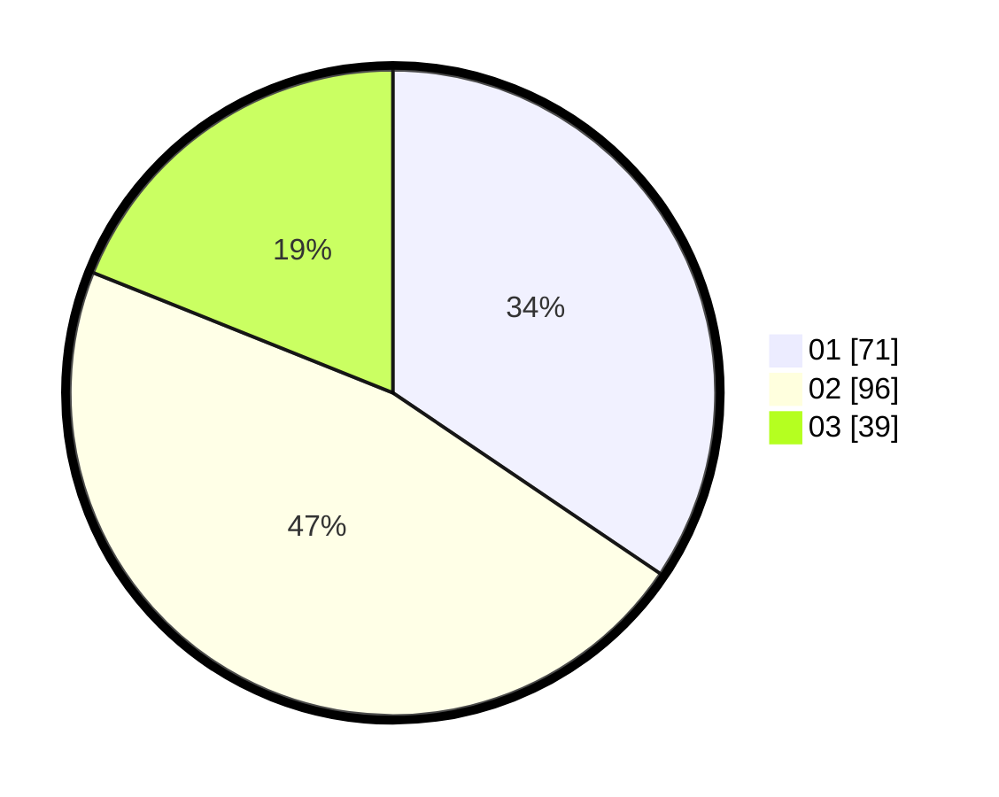

# Hasil

Hasil perolehan suara paslon dapat dilihat pada file paslon-01.txt, paslon-02.txt, dan paslon-03.txt.

Jika tidak ada, artinya data tersebut belum ada pada SIREKAP.

## Perolehan Suara

 * Paslon 01: **71**.
 * Paslon 02: **96**.
 * Paslon 03: **39**.

## Foto C Plano

https://sirekap-obj-formc.kpu.go.id/9b17/pemilu/ppwp/31/71/01/10/04/3171011004032-20240216-135728--123455d6-7f0d-441a-9aac-189134b019e0.jpg

https://sirekap-obj-formc.kpu.go.id/9b17/pemilu/ppwp/31/71/01/10/04/3171011004032-20240216-135729--4b363b69-2d10-47c8-a1e0-a2f8968b703a.jpg

https://sirekap-obj-formc.kpu.go.id/9b17/pemilu/ppwp/31/71/01/10/04/3171011004032-20240216-135728--edabc88f-250b-4401-9447-fe5797782174.jpg

## DATA PEMILIH TETAP

Jumlah pemilih dalam DPT: **271**.
 * L: **132**.
 * P: **139**.

## DATA PENGGUNA HAK PILIH

Jumlah pengguna hak pilih dalam DPT: **195**.
 * L: **88**.
 * P: **107**.

Jumlah pengguna hak pilih dalam DPTb: **7**.
 * L: **3**.
 * P: **4**.

Jumlah pengguna hak pilih dalam DPK: **4**.
 * L: **1**.
 * P: **3**.

Jumlah pengguna hak pilih: **206**.
 * L: **92**.
 * P: **114**.

## JUMLAH SUARA SAH DAN TIDAK SAH

JUMLAH SELURUH SUARA SAH: **206**.

JUMLAH SUARA TIDAK SAH: **0**.

JUMLAH SELURUH SUARA SAH DAN SUARA TIDAK SAH: **206**.
