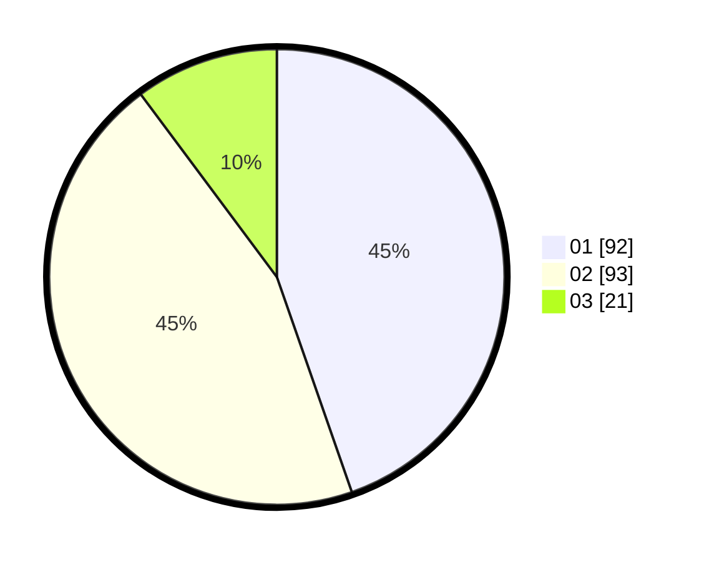

# Hasil

Hasil perolehan suara paslon dapat dilihat pada file paslon-01.txt, paslon-02.txt, dan paslon-03.txt.

Jika tidak ada, artinya data tersebut belum ada pada SIREKAP.

## Perolehan Suara

 * Paslon 01: **92**.
 * Paslon 02: **93**.
 * Paslon 03: **21**.

## Foto C Plano

https://sirekap-obj-formc.kpu.go.id/3e91/pemilu/ppwp/31/71/01/10/04/3171011004033-20240216-001724--8892a9af-d04a-4d94-b0c4-b30181012477.jpg

https://sirekap-obj-formc.kpu.go.id/3e91/pemilu/ppwp/31/71/01/10/04/3171011004033-20240216-001730--272bc864-da00-4eed-8ecf-66ece7f07476.jpg

https://sirekap-obj-formc.kpu.go.id/3e91/pemilu/ppwp/31/71/01/10/04/3171011004033-20240216-001727--0053ccee-a14a-4bde-bbde-9935cf1df8c4.jpg

## DATA PEMILIH TETAP

Jumlah pemilih dalam DPT: **270**.
 * L: **149**.
 * P: **121**.

## DATA PENGGUNA HAK PILIH

Jumlah pengguna hak pilih dalam DPT: **198**.
 * L: **105**.
 * P: **93**.

Jumlah pengguna hak pilih dalam DPTb: **8**.
 * L: **4**.
 * P: **4**.

Jumlah pengguna hak pilih dalam DPK: **3**.
 * L: **2**.
 * P: **1**.

Jumlah pengguna hak pilih: **209**.
 * L: **111**.
 * P: **98**.

## JUMLAH SUARA SAH DAN TIDAK SAH

JUMLAH SELURUH SUARA SAH: **206**.

JUMLAH SUARA TIDAK SAH: **4**.

JUMLAH SELURUH SUARA SAH DAN SUARA TIDAK SAH: **210**.
