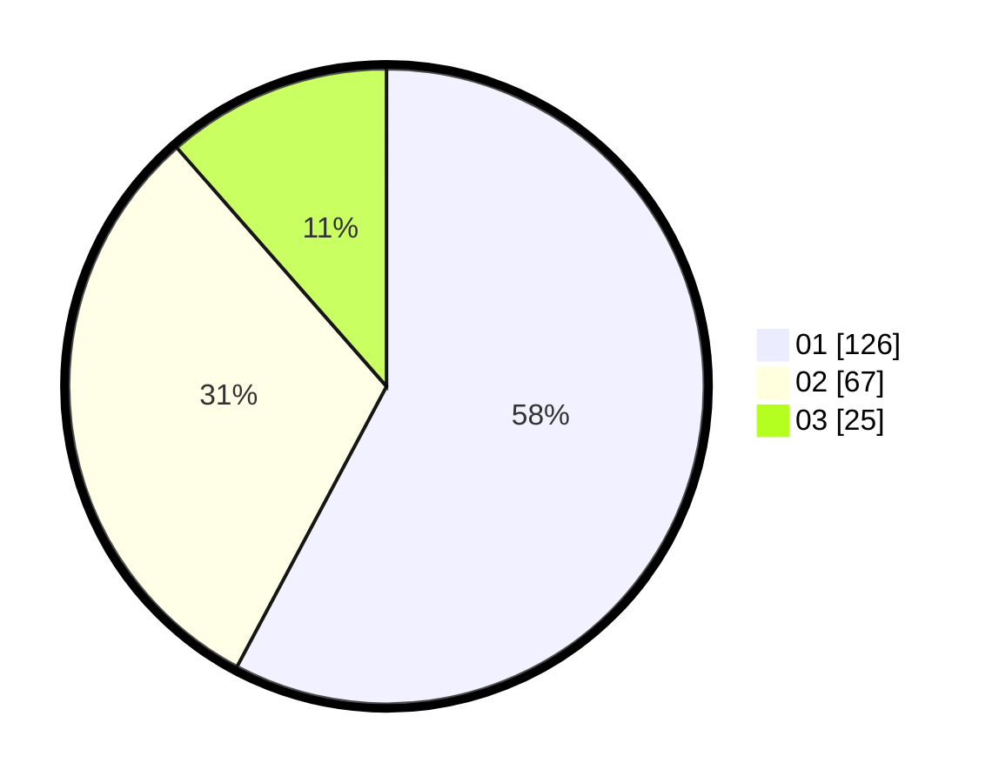

# Hasil

Hasil perolehan suara paslon dapat dilihat pada file paslon-01.txt, paslon-02.txt, dan paslon-03.txt.

Jika tidak ada, artinya data tersebut belum ada pada SIREKAP.

## Perolehan Suara

 * Paslon 01: **126**.
 * Paslon 02: **67**.
 * Paslon 03: **25**.

## Foto C Plano

https://sirekap-obj-formc.kpu.go.id/1fe5/pemilu/ppwp/31/71/01/10/04/3171011004039-20240215-020437--2dd9608b-9b9a-4d06-aae0-adc217c906e3.jpg

https://sirekap-obj-formc.kpu.go.id/1fe5/pemilu/ppwp/31/71/01/10/04/3171011004039-20240214-235359--49265852-9ca4-461a-a900-db4d16b30a75.jpg

https://sirekap-obj-formc.kpu.go.id/1fe5/pemilu/ppwp/31/71/01/10/04/3171011004039-20240215-020550--5a735c62-12ea-4124-8c5e-a961f406c658.jpg

## DATA PEMILIH TETAP

Jumlah pemilih dalam DPT: **270**.
 * L: **137**.
 * P: **133**.

## DATA PENGGUNA HAK PILIH

Jumlah pengguna hak pilih dalam DPT: **212**.
 * L: **99**.
 * P: **113**.

Jumlah pengguna hak pilih dalam DPTb: **8**.
 * L: **6**.
 * P: **2**.

Jumlah pengguna hak pilih dalam DPK: **1**.
 * L: **1**.
 * P: **0**.

Jumlah pengguna hak pilih: **221**.
 * L: **106**.
 * P: **115**.

## JUMLAH SUARA SAH DAN TIDAK SAH

JUMLAH SELURUH SUARA SAH: **218**.

JUMLAH SUARA TIDAK SAH: **3**.

JUMLAH SELURUH SUARA SAH DAN SUARA TIDAK SAH: **221**.
