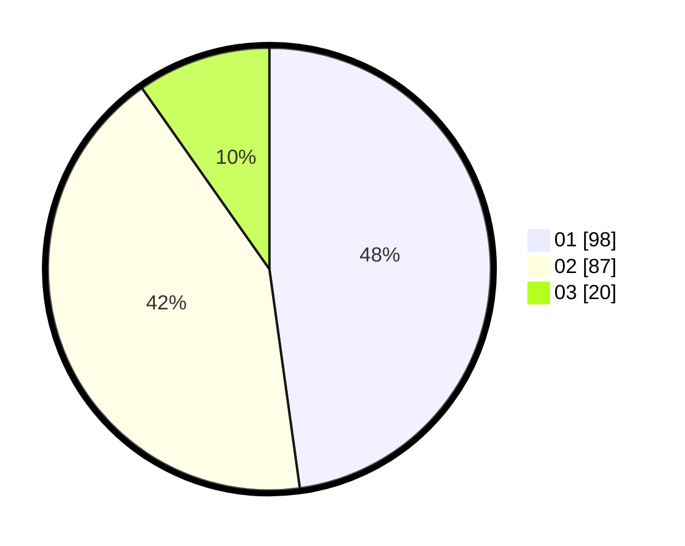

# Hasil

Hasil perolehan suara paslon dapat dilihat pada file paslon-01.txt, paslon-02.txt, dan paslon-03.txt.

Jika tidak ada, artinya data tersebut belum ada pada SIREKAP.

## Perolehan Suara

 * Paslon 01: **98**.
 * Paslon 02: **87**.
 * Paslon 03: **20**.

## Foto C Plano

https://sirekap-obj-formc.kpu.go.id/cde1/pemilu/ppwp/31/71/01/10/04/3171011004043-20240214-231757--8b7ac4b6-4cc6-42c6-9ae3-891ac91bb106.jpg

https://sirekap-obj-formc.kpu.go.id/cde1/pemilu/ppwp/31/71/01/10/04/3171011004043-20240214-231922--e80d1bcc-f0d4-4bc5-bf5d-eff1273cdec2.jpg

https://sirekap-obj-formc.kpu.go.id/cde1/pemilu/ppwp/31/71/01/10/04/3171011004043-20240214-232128--36315352-a72e-41bb-885a-ddfd68109236.jpg

## DATA PEMILIH TETAP

Jumlah pemilih dalam DPT: **272**.
 * L: **152**.
 * P: **120**.

## DATA PENGGUNA HAK PILIH

Jumlah pengguna hak pilih dalam DPT: **193**.
 * L: **101**.
 * P: **92**.

Jumlah pengguna hak pilih dalam DPTb: **10**.
 * L: **5**.
 * P: **5**.

Jumlah pengguna hak pilih dalam DPK: **3**.
 * L: **2**.
 * P: **1**.

Jumlah pengguna hak pilih: **206**.
 * L: **108**.
 * P: **98**.

## JUMLAH SUARA SAH DAN TIDAK SAH

JUMLAH SELURUH SUARA SAH: **205**.

JUMLAH SUARA TIDAK SAH: **1**.

JUMLAH SELURUH SUARA SAH DAN SUARA TIDAK SAH: **206**.
