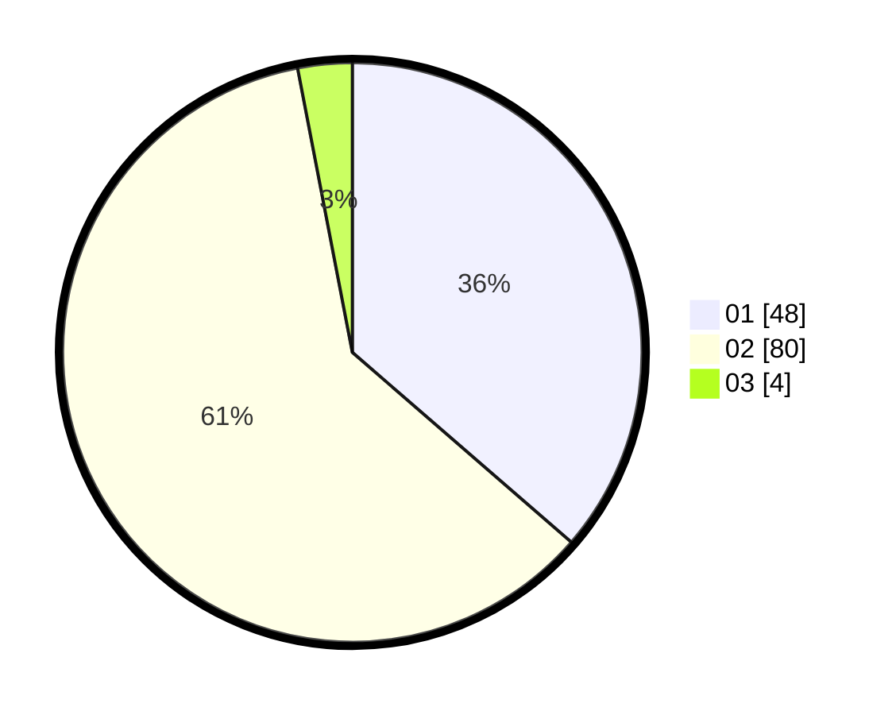

# Hasil

Hasil perolehan suara paslon dapat dilihat pada file paslon-01.txt, paslon-02.txt, dan paslon-03.txt.

Jika tidak ada, artinya data tersebut belum ada pada SIREKAP.

## Perolehan Suara

 * Paslon 01: **48**.
 * Paslon 02: **80**.
 * Paslon 03: **4**.

## Foto C Plano

https://sirekap-obj-formc.kpu.go.id/0d3d/pemilu/ppwp/31/71/01/10/04/3171011004045-20240214-214450--213a31a9-3680-495d-b0ce-b189b0ec1de7.jpg

https://sirekap-obj-formc.kpu.go.id/0d3d/pemilu/ppwp/31/71/01/10/04/3171011004045-20240214-214601--0fba95cd-6a5b-41fe-9f00-a23e74970569.jpg

https://sirekap-obj-formc.kpu.go.id/0d3d/pemilu/ppwp/31/71/01/10/04/3171011004045-20240214-214652--b2f10836-18ce-4c27-ae58-bb51d19e957d.jpg
