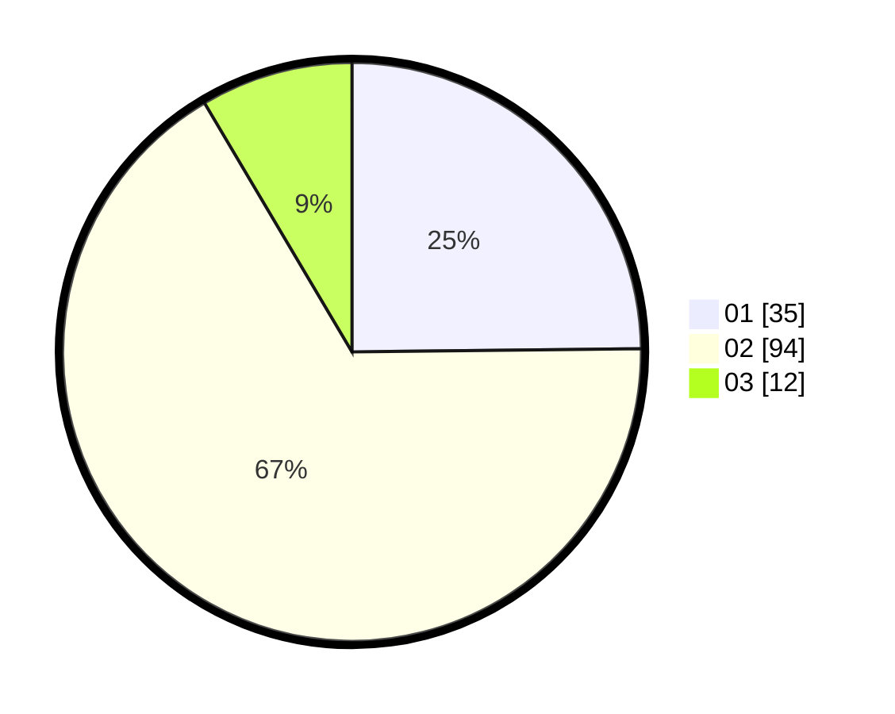

# Hasil

Hasil perolehan suara paslon dapat dilihat pada file paslon-01.txt, paslon-02.txt, dan paslon-03.txt.

Jika tidak ada, artinya data tersebut belum ada pada SIREKAP.

## Perolehan Suara

 * Paslon 01: **35**.
 * Paslon 02: **94**.
 * Paslon 03: **12**.

## Foto C Plano

https://sirekap-obj-formc.kpu.go.id/b8e4/pemilu/ppwp/31/71/01/10/04/3171011004046-20240214-212623--b47d7c59-6ed0-4ce9-b256-285b954bd145.jpg

https://sirekap-obj-formc.kpu.go.id/b8e4/pemilu/ppwp/31/71/01/10/04/3171011004046-20240214-212704--2c9f0222-13cc-4fca-98d6-fccf10606d20.jpg

https://sirekap-obj-formc.kpu.go.id/b8e4/pemilu/ppwp/31/71/01/10/04/3171011004046-20240214-212747--a5d372b9-f45c-4c9b-87c3-7a3835a1455d.jpg

## DATA PEMILIH TETAP

Jumlah pemilih dalam DPT: **267**.
 * L: **34**.
 * P: **233**.

## DATA PENGGUNA HAK PILIH

Jumlah pengguna hak pilih dalam DPT: **104**.
 * L: **16**.
 * P: **88**.

Jumlah pengguna hak pilih dalam DPTb: **23**.
 * L: **10**.
 * P: **13**.

Jumlah pengguna hak pilih dalam DPK: **14**.
 * L: **4**.
 * P: **10**.

Jumlah pengguna hak pilih: **141**.
 * L: **30**.
 * P: **101**.

## JUMLAH SUARA SAH DAN TIDAK SAH

JUMLAH SELURUH SUARA SAH: **141**.

JUMLAH SUARA TIDAK SAH: **0**.

JUMLAH SELURUH SUARA SAH DAN SUARA TIDAK SAH: **141**.
