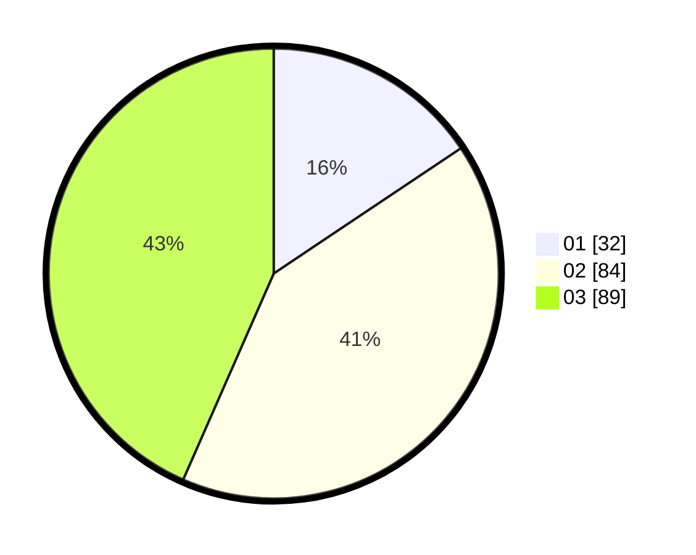

# Hasil

Hasil perolehan suara paslon dapat dilihat pada file paslon-01.txt, paslon-02.txt, dan paslon-03.txt.

Jika tidak ada, artinya data tersebut belum ada pada SIREKAP.

## Perolehan Suara

 * Paslon 01: **32**.
 * Paslon 02: **84**.
 * Paslon 03: **89**.

## Foto C Plano

https://sirekap-obj-formc.kpu.go.id/b97a/pemilu/ppwp/31/71/01/10/05/3171011005001-20240216-182459--0c665816-7b9a-49ff-8c43-2fe2a692fa94.jpg

https://sirekap-obj-formc.kpu.go.id/b97a/pemilu/ppwp/31/71/01/10/05/3171011005001-20240216-182500--555f2c68-368b-43dd-bb02-a980953b80d7.jpg

https://sirekap-obj-formc.kpu.go.id/b97a/pemilu/ppwp/31/71/01/10/05/3171011005001-20240216-182459--43d71d75-10e2-4d10-b628-8cc0c01521b0.jpg

## DATA PEMILIH TETAP

Jumlah pemilih dalam DPT: **285**.
 * L: **142**.
 * P: **143**.

## DATA PENGGUNA HAK PILIH

Jumlah pengguna hak pilih dalam DPT: **182**.
 * L: **81**.
 * P: **101**.

Jumlah pengguna hak pilih dalam DPTb: **21**.
 * L: **5**.
 * P: **16**.

Jumlah pengguna hak pilih dalam DPK: **4**.
 * L: **3**.
 * P: **1**.

Jumlah pengguna hak pilih: **207**.
 * L: **89**.
 * P: **118**.

## JUMLAH SUARA SAH DAN TIDAK SAH

JUMLAH SELURUH SUARA SAH: **205**.

JUMLAH SUARA TIDAK SAH: **2**.

JUMLAH SELURUH SUARA SAH DAN SUARA TIDAK SAH: **207**.
