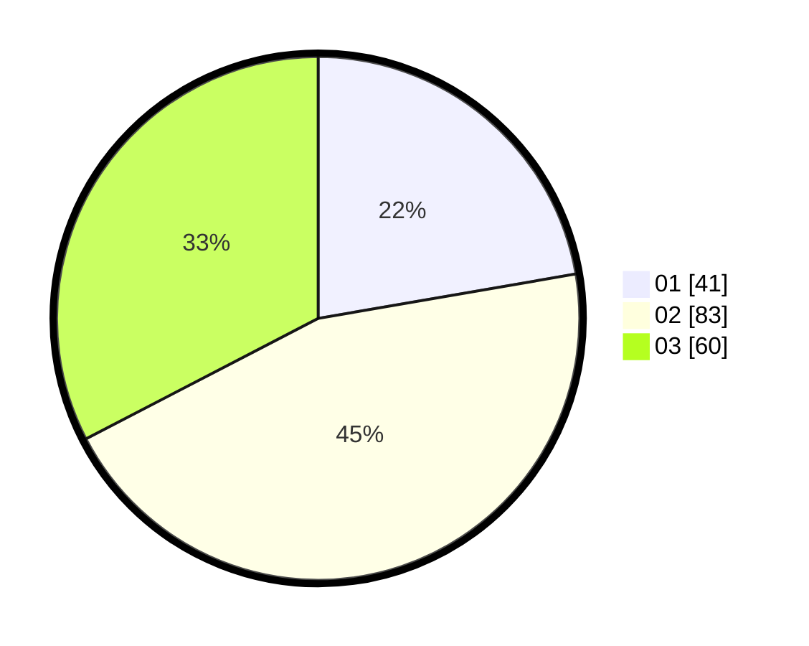

# Hasil

Hasil perolehan suara paslon dapat dilihat pada file paslon-01.txt, paslon-02.txt, dan paslon-03.txt.

Jika tidak ada, artinya data tersebut belum ada pada SIREKAP.

## Perolehan Suara

 * Paslon 01: **41**.
 * Paslon 02: **83**.
 * Paslon 03: **60**.

## Foto C Plano

https://sirekap-obj-formc.kpu.go.id/280a/pemilu/ppwp/31/71/01/10/05/3171011005003-20240217-230411--c3498317-276e-4ea4-ae99-40acd42e67cb.jpg

https://sirekap-obj-formc.kpu.go.id/280a/pemilu/ppwp/31/71/01/10/05/3171011005003-20240217-230551--32ca818d-9049-45f7-9960-ae4e4fe10018.jpg

https://sirekap-obj-formc.kpu.go.id/280a/pemilu/ppwp/31/71/01/10/05/3171011005003-20240217-234107--cd253691-4caa-467f-b70a-8b05eaa3e2f9.jpg

## DATA PEMILIH TETAP

Jumlah pemilih dalam DPT: **252**.
 * L: **127**.
 * P: **125**.

## DATA PENGGUNA HAK PILIH

Jumlah pengguna hak pilih dalam DPT: **165**.
 * L: **81**.
 * P: **84**.

Jumlah pengguna hak pilih dalam DPTb: **18**.
 * L: **11**.
 * P: **7**.

Jumlah pengguna hak pilih dalam DPK: **2**.
 * L: **1**.
 * P: **1**.

Jumlah pengguna hak pilih: **185**.
 * L: **93**.
 * P: **92**.

## JUMLAH SUARA SAH DAN TIDAK SAH

JUMLAH SELURUH SUARA SAH: **184**.

JUMLAH SUARA TIDAK SAH: **2**.

JUMLAH SELURUH SUARA SAH DAN SUARA TIDAK SAH: **186**.
