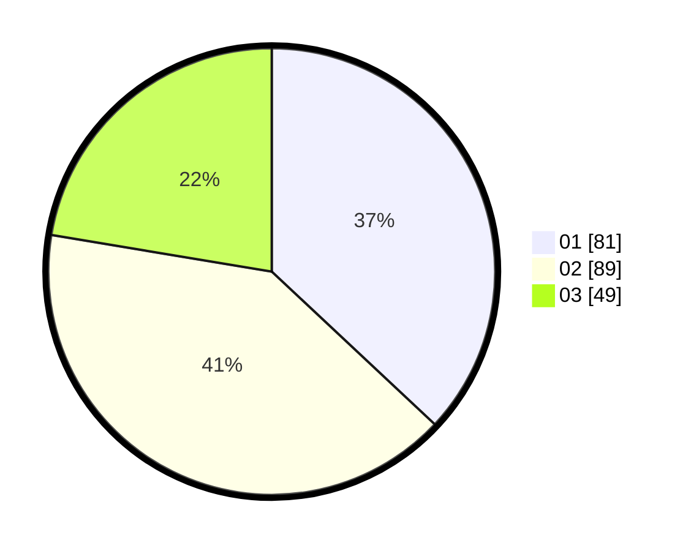

# Hasil

Hasil perolehan suara paslon dapat dilihat pada file paslon-01.txt, paslon-02.txt, dan paslon-03.txt.

Jika tidak ada, artinya data tersebut belum ada pada SIREKAP.

## Perolehan Suara

 * Paslon 01: **81**.
 * Paslon 02: **89**.
 * Paslon 03: **49**.

## Foto C Plano

https://sirekap-obj-formc.kpu.go.id/d603/pemilu/ppwp/31/71/01/10/05/3171011005008-20240214-190852--3b7e9e49-5dfe-4bb0-a221-406f981ef283.jpg

https://sirekap-obj-formc.kpu.go.id/d603/pemilu/ppwp/31/71/01/10/05/3171011005008-20240214-191019--c4c4995f-3d89-4047-9a7d-b004c169e7da.jpg

https://sirekap-obj-formc.kpu.go.id/d603/pemilu/ppwp/31/71/01/10/05/3171011005008-20240214-192514--7139dfc5-4ebf-4342-86b1-61709bee6d01.jpg

## DATA PEMILIH TETAP

Jumlah pemilih dalam DPT: **274**.
 * L: **144**.
 * P: **130**.

## DATA PENGGUNA HAK PILIH

Jumlah pengguna hak pilih dalam DPT: **197**.
 * L: **101**.
 * P: **96**.

Jumlah pengguna hak pilih dalam DPTb: **18**.
 * L: **10**.
 * P: **8**.

Jumlah pengguna hak pilih dalam DPK: **6**.
 * L: **2**.
 * P: **4**.

Jumlah pengguna hak pilih: **221**.
 * L: **113**.
 * P: **108**.

## JUMLAH SUARA SAH DAN TIDAK SAH

JUMLAH SELURUH SUARA SAH: **219**.

JUMLAH SUARA TIDAK SAH: **2**.

JUMLAH SELURUH SUARA SAH DAN SUARA TIDAK SAH: **221**.
