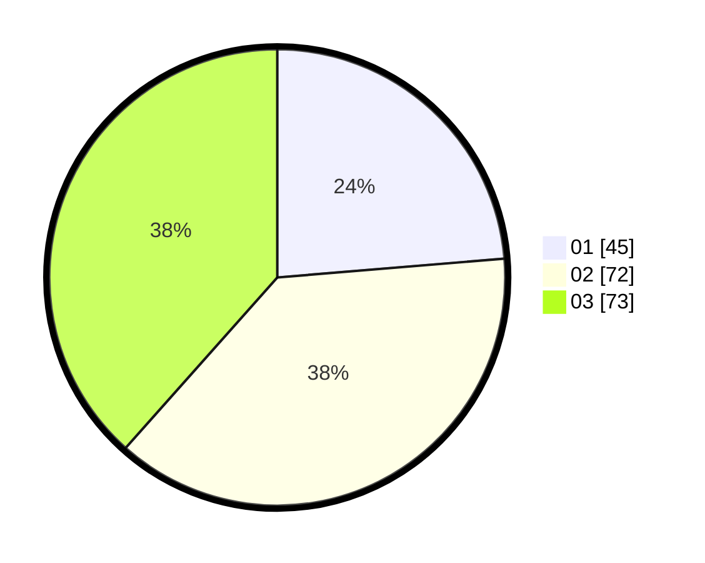

# Hasil

Hasil perolehan suara paslon dapat dilihat pada file paslon-01.txt, paslon-02.txt, dan paslon-03.txt.

Jika tidak ada, artinya data tersebut belum ada pada SIREKAP.

## Perolehan Suara

 * Paslon 01: **45**.
 * Paslon 02: **72**.
 * Paslon 03: **73**.

## Foto C Plano

https://sirekap-obj-formc.kpu.go.id/a622/pemilu/ppwp/31/71/01/10/05/3171011005009-20240216-211738--cf04ea85-f0f0-4485-af0d-b28970c55bdf.jpg

https://sirekap-obj-formc.kpu.go.id/a622/pemilu/ppwp/31/71/01/10/05/3171011005009-20240216-211739--00b8d6aa-a492-417e-ab45-358729457241.jpg

https://sirekap-obj-formc.kpu.go.id/a622/pemilu/ppwp/31/71/01/10/05/3171011005009-20240216-211739--4df876d8-618d-4362-b483-890f94ba1d09.jpg

## DATA PEMILIH TETAP

Jumlah pemilih dalam DPT: **235**.
 * L: **116**.
 * P: **119**.

## DATA PENGGUNA HAK PILIH

Jumlah pengguna hak pilih dalam DPT: **176**.
 * L: **87**.
 * P: **89**.

Jumlah pengguna hak pilih dalam DPTb: **12**.
 * L: **1**.
 * P: **11**.

Jumlah pengguna hak pilih dalam DPK: **6**.
 * L: **3**.
 * P: **3**.

Jumlah pengguna hak pilih: **194**.
 * L: **91**.
 * P: **103**.

## JUMLAH SUARA SAH DAN TIDAK SAH

JUMLAH SELURUH SUARA SAH: **190**.

JUMLAH SUARA TIDAK SAH: **3**.

JUMLAH SELURUH SUARA SAH DAN SUARA TIDAK SAH: **193**.
