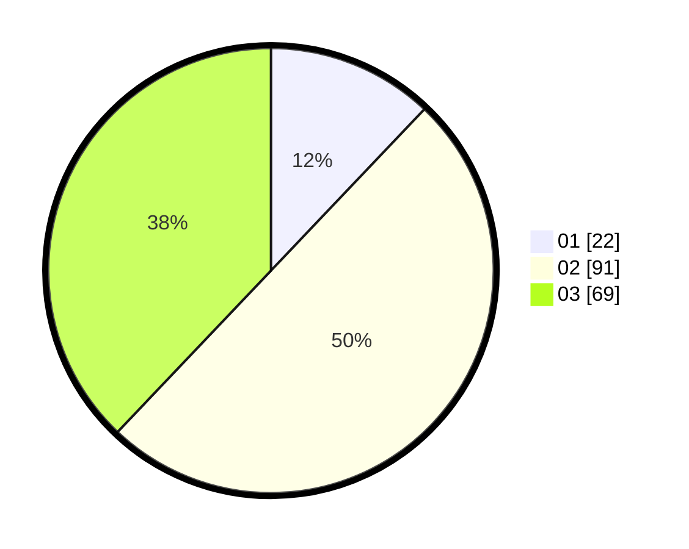

# Hasil

Hasil perolehan suara paslon dapat dilihat pada file paslon-01.txt, paslon-02.txt, dan paslon-03.txt.

Jika tidak ada, artinya data tersebut belum ada pada SIREKAP.

## Perolehan Suara

 * Paslon 01: **22**.
 * Paslon 02: **91**.
 * Paslon 03: **69**.

## Foto C Plano

https://sirekap-obj-formc.kpu.go.id/99eb/pemilu/ppwp/31/71/01/10/05/3171011005010-20240216-133705--3f9f74e0-5cb1-451f-a995-223842b5fb49.jpg

https://sirekap-obj-formc.kpu.go.id/99eb/pemilu/ppwp/31/71/01/10/05/3171011005010-20240216-133706--92ae3752-2037-4e26-8829-5e3f3f1c9747.jpg

https://sirekap-obj-formc.kpu.go.id/99eb/pemilu/ppwp/31/71/01/10/05/3171011005010-20240216-133706--80527094-a546-495d-a610-d8a666c41aeb.jpg

## DATA PEMILIH TETAP

Jumlah pemilih dalam DPT: **184**.
 * L: **89**.
 * P: **95**.

## DATA PENGGUNA HAK PILIH

Jumlah pengguna hak pilih dalam DPT: **165**.
 * L: **79**.
 * P: **86**.

Jumlah pengguna hak pilih dalam DPTb: **18**.
 * L: **9**.
 * P: **9**.

Jumlah pengguna hak pilih dalam DPK: **1**.
 * L: **1**.
 * P: **0**.

Jumlah pengguna hak pilih: **184**.
 * L: **89**.
 * P: **95**.

## JUMLAH SUARA SAH DAN TIDAK SAH

JUMLAH SELURUH SUARA SAH: **182**.

JUMLAH SUARA TIDAK SAH: **2**.

JUMLAH SELURUH SUARA SAH DAN SUARA TIDAK SAH: **184**.
