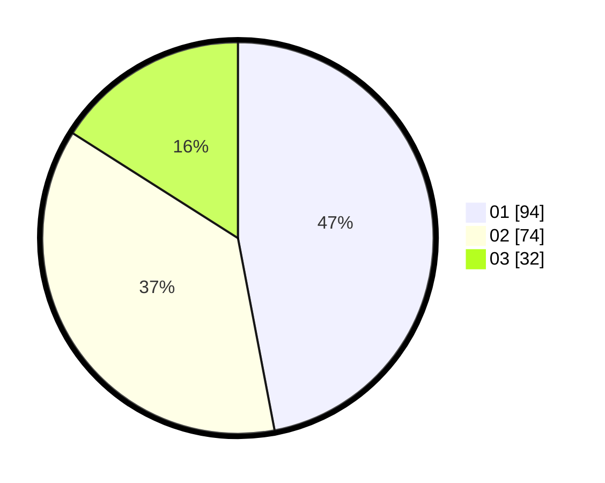

# Hasil

Hasil perolehan suara paslon dapat dilihat pada file paslon-01.txt, paslon-02.txt, dan paslon-03.txt.

Jika tidak ada, artinya data tersebut belum ada pada SIREKAP.

## Perolehan Suara

 * Paslon 01: **94**.
 * Paslon 02: **74**.
 * Paslon 03: **32**.

## Foto C Plano

https://sirekap-obj-formc.kpu.go.id/c8a4/pemilu/ppwp/31/71/01/10/05/3171011005015-20240215-162158--4b5f1af7-f5c7-46ef-8486-e910e9707006.jpg

https://sirekap-obj-formc.kpu.go.id/c8a4/pemilu/ppwp/31/71/01/10/05/3171011005015-20240214-184721--924ecfb4-5de7-4fdc-a36b-c99a967cdc25.jpg

https://sirekap-obj-formc.kpu.go.id/c8a4/pemilu/ppwp/31/71/01/10/05/3171011005015-20240214-184813--348b8ffb-b608-4398-b841-a6f21f666f7c.jpg

## DATA PEMILIH TETAP

Jumlah pemilih dalam DPT: **229**.
 * L: **111**.
 * P: **118**.

## DATA PENGGUNA HAK PILIH

Jumlah pengguna hak pilih dalam DPT: **151**.
 * L: **71**.
 * P: **80**.

Jumlah pengguna hak pilih dalam DPTb: **15**.
 * L: **5**.
 * P: **10**.

Jumlah pengguna hak pilih dalam DPK: **33**.
 * L: **20**.
 * P: **13**.

Jumlah pengguna hak pilih: **199**.
 * L: **96**.
 * P: **103**.

## JUMLAH SUARA SAH DAN TIDAK SAH

JUMLAH SELURUH SUARA SAH: **200**.

JUMLAH SUARA TIDAK SAH: **1**.

JUMLAH SELURUH SUARA SAH DAN SUARA TIDAK SAH: **201**.
