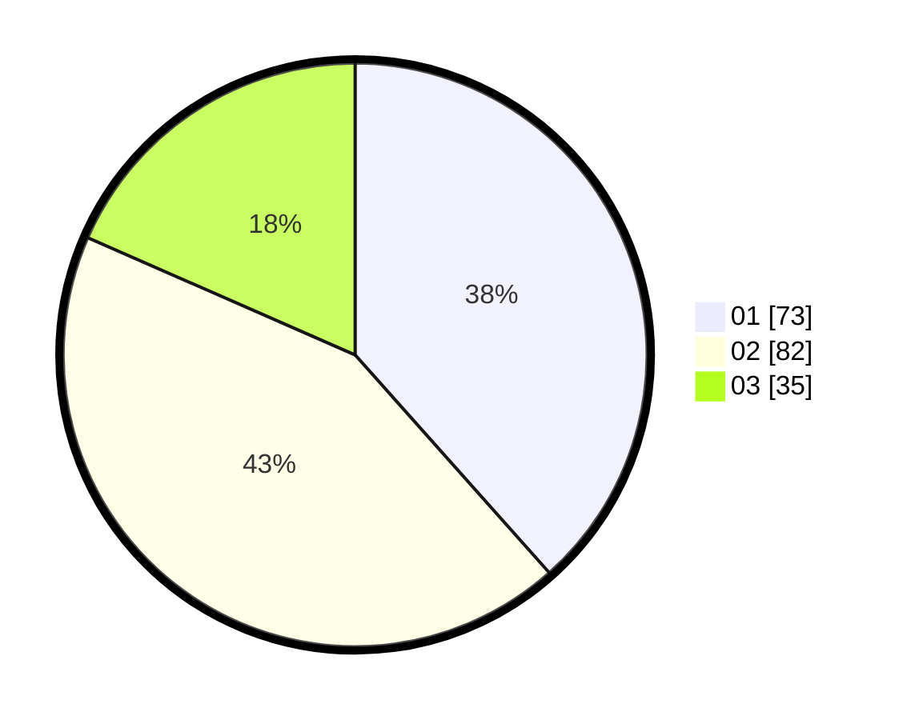

# Hasil

Hasil perolehan suara paslon dapat dilihat pada file paslon-01.txt, paslon-02.txt, dan paslon-03.txt.

Jika tidak ada, artinya data tersebut belum ada pada SIREKAP.

## Perolehan Suara

 * Paslon 01: **73**.
 * Paslon 02: **82**.
 * Paslon 03: **35**.

## Foto C Plano

https://sirekap-obj-formc.kpu.go.id/4c5f/pemilu/ppwp/31/71/01/10/05/3171011005016-20240216-144435--bd56335c-42da-4df6-9eb8-c7668c9ab025.jpg

https://sirekap-obj-formc.kpu.go.id/4c5f/pemilu/ppwp/31/71/01/10/05/3171011005016-20240216-144437--a779cb7e-7236-41aa-badb-172e4e7e3d2d.jpg

https://sirekap-obj-formc.kpu.go.id/4c5f/pemilu/ppwp/31/71/01/10/05/3171011005016-20240216-144436--cd8d7a12-64bb-43b7-8401-5d36b03ee334.jpg

## DATA PEMILIH TETAP

Jumlah pemilih dalam DPT: **179**.
 * L: **86**.
 * P: **93**.

## DATA PENGGUNA HAK PILIH

Jumlah pengguna hak pilih dalam DPT: **179**.
 * L: **86**.
 * P: **93**.

Jumlah pengguna hak pilih dalam DPTb: **12**.
 * L: **3**.
 * P: **9**.

Jumlah pengguna hak pilih dalam DPK: **2**.
 * L: **2**.
 * P: **0**.

Jumlah pengguna hak pilih: **193**.
 * L: **91**.
 * P: **102**.

## JUMLAH SUARA SAH DAN TIDAK SAH

JUMLAH SELURUH SUARA SAH: **190**.

JUMLAH SUARA TIDAK SAH: **3**.

JUMLAH SELURUH SUARA SAH DAN SUARA TIDAK SAH: **193**.
