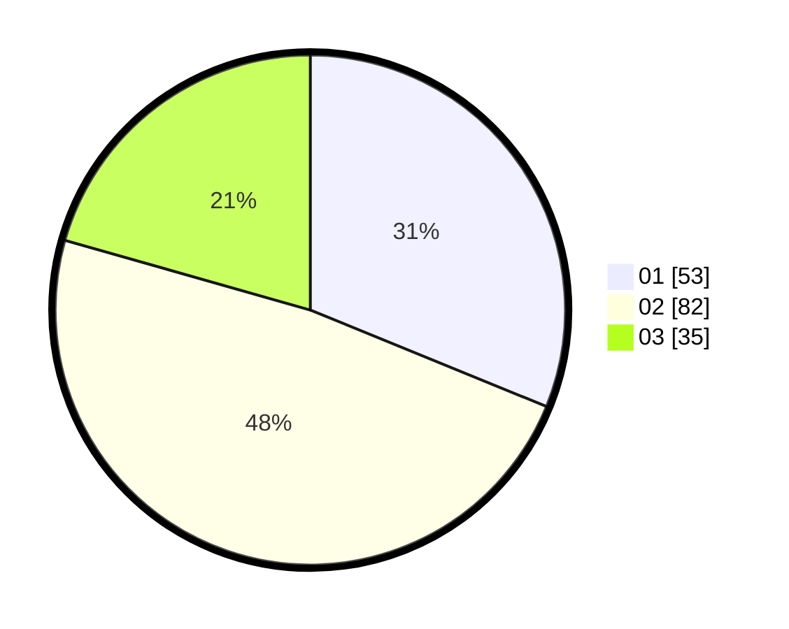

# Hasil

Hasil perolehan suara paslon dapat dilihat pada file paslon-01.txt, paslon-02.txt, dan paslon-03.txt.

Jika tidak ada, artinya data tersebut belum ada pada SIREKAP.

## Perolehan Suara

 * Paslon 01: **53**.
 * Paslon 02: **82**.
 * Paslon 03: **35**.

## Foto C Plano

https://sirekap-obj-formc.kpu.go.id/6414/pemilu/ppwp/31/71/01/10/05/3171011005017-20240215-213710--842b46b5-9155-4472-897e-9c050be757d3.jpg

https://sirekap-obj-formc.kpu.go.id/6414/pemilu/ppwp/31/71/01/10/05/3171011005017-20240215-213713--82785c5b-5d74-4e32-afa6-5985d40baeeb.jpg

https://sirekap-obj-formc.kpu.go.id/6414/pemilu/ppwp/31/71/01/10/05/3171011005017-20240215-213712--cc668d0f-7ada-427e-b28e-2e9f947fc15b.jpg

## DATA PEMILIH TETAP

Jumlah pemilih dalam DPT: **238**.
 * L: **121**.
 * P: **117**.

## DATA PENGGUNA HAK PILIH

Jumlah pengguna hak pilih dalam DPT: **157**.
 * L: **74**.
 * P: **83**.

Jumlah pengguna hak pilih dalam DPTb: **12**.
 * L: **4**.
 * P: **8**.

Jumlah pengguna hak pilih dalam DPK: **4**.
 * L: **4**.
 * P: **0**.

Jumlah pengguna hak pilih: **173**.
 * L: **82**.
 * P: **91**.

## JUMLAH SUARA SAH DAN TIDAK SAH

JUMLAH SELURUH SUARA SAH: **170**.

JUMLAH SUARA TIDAK SAH: **3**.

JUMLAH SELURUH SUARA SAH DAN SUARA TIDAK SAH: **173**.
