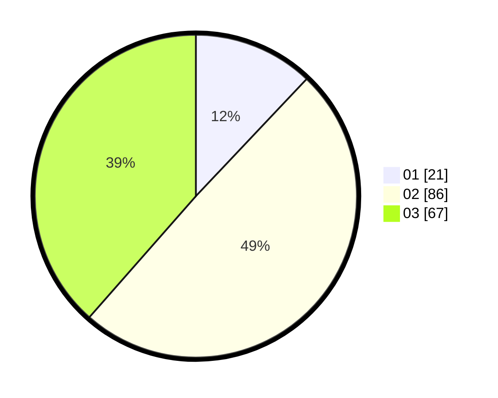

# Hasil

Hasil perolehan suara paslon dapat dilihat pada file paslon-01.txt, paslon-02.txt, dan paslon-03.txt.

Jika tidak ada, artinya data tersebut belum ada pada SIREKAP.

## Perolehan Suara

 * Paslon 01: **21**.
 * Paslon 02: **86**.
 * Paslon 03: **67**.

## Foto C Plano

https://sirekap-obj-formc.kpu.go.id/27a6/pemilu/ppwp/31/71/01/10/05/3171011005021-20240216-175736--03117e1f-8107-4ac7-904e-5e7d5050a143.jpg

https://sirekap-obj-formc.kpu.go.id/27a6/pemilu/ppwp/31/71/01/10/05/3171011005021-20240216-175737--1a2e6271-a4c1-4032-a4cf-5d3bfd6c7ed9.jpg

https://sirekap-obj-formc.kpu.go.id/27a6/pemilu/ppwp/31/71/01/10/05/3171011005021-20240216-175737--679f3333-9742-4f42-a8e0-74b6b712c4f5.jpg

## DATA PEMILIH TETAP

Jumlah pemilih dalam DPT: **157**.
 * L: **79**.
 * P: **78**.

## DATA PENGGUNA HAK PILIH

Jumlah pengguna hak pilih dalam DPT: **157**.
 * L: **79**.
 * P: **78**.

Jumlah pengguna hak pilih dalam DPTb: **17**.
 * L: **8**.
 * P: **9**.

Jumlah pengguna hak pilih dalam DPK: **2**.
 * L: **2**.
 * P: **0**.

Jumlah pengguna hak pilih: **176**.
 * L: **89**.
 * P: **87**.

## JUMLAH SUARA SAH DAN TIDAK SAH

JUMLAH SELURUH SUARA SAH: **174**.

JUMLAH SUARA TIDAK SAH: **2**.

JUMLAH SELURUH SUARA SAH DAN SUARA TIDAK SAH: **176**.
