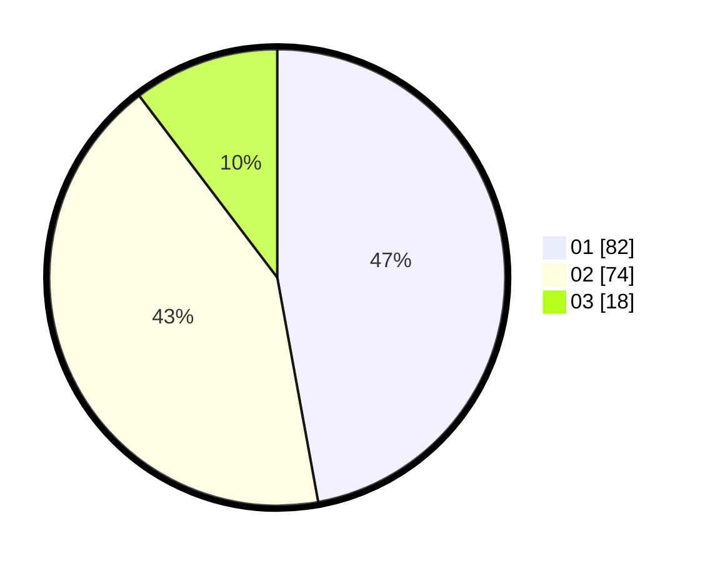

# Hasil

Hasil perolehan suara paslon dapat dilihat pada file paslon-01.txt, paslon-02.txt, dan paslon-03.txt.

Jika tidak ada, artinya data tersebut belum ada pada SIREKAP.

## Perolehan Suara

 * Paslon 01: **82**.
 * Paslon 02: **74**.
 * Paslon 03: **18**.

## Foto C Plano

https://sirekap-obj-formc.kpu.go.id/a584/pemilu/ppwp/31/71/01/10/05/3171011005029-20240215-205558--0afac588-27e3-48e6-9789-e27685f031b8.jpg

https://sirekap-obj-formc.kpu.go.id/a584/pemilu/ppwp/31/71/01/10/05/3171011005029-20240215-205601--682912b3-ceea-49b8-a43f-f2e72c6b2329.jpg

https://sirekap-obj-formc.kpu.go.id/a584/pemilu/ppwp/31/71/01/10/05/3171011005029-20240215-205559--60ebc047-a658-446f-99aa-6774ee6aa86a.jpg

## DATA PEMILIH TETAP

Jumlah pemilih dalam DPT: **247**.
 * L: **124**.
 * P: **123**.

## DATA PENGGUNA HAK PILIH

Jumlah pengguna hak pilih dalam DPT: **179**.
 * L: **85**.
 * P: **94**.

Jumlah pengguna hak pilih dalam DPTb: **7**.
 * L: **2**.
 * P: **5**.

Jumlah pengguna hak pilih dalam DPK: **2**.
 * L: **2**.
 * P: **0**.

Jumlah pengguna hak pilih: **188**.
 * L: **89**.
 * P: **99**.

## JUMLAH SUARA SAH DAN TIDAK SAH

JUMLAH SELURUH SUARA SAH: **174**.

JUMLAH SUARA TIDAK SAH: **5**.

JUMLAH SELURUH SUARA SAH DAN SUARA TIDAK SAH: **179**.
