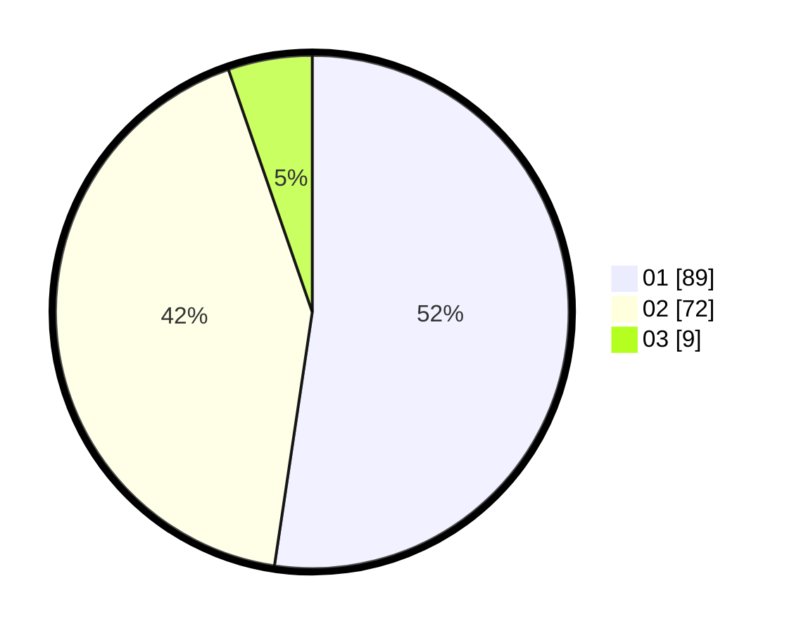

# Hasil

Hasil perolehan suara paslon dapat dilihat pada file paslon-01.txt, paslon-02.txt, dan paslon-03.txt.

Jika tidak ada, artinya data tersebut belum ada pada SIREKAP.

## Perolehan Suara

 * Paslon 01: **89**.
 * Paslon 02: **72**.
 * Paslon 03: **9**.

## Foto C Plano

https://sirekap-obj-formc.kpu.go.id/1f4f/pemilu/ppwp/31/71/01/10/05/3171011005032-20240214-224342--b70767e4-751d-40c1-aac3-1098f47fe476.jpg

https://sirekap-obj-formc.kpu.go.id/1f4f/pemilu/ppwp/31/71/01/10/05/3171011005032-20240214-224507--db930223-23c7-4553-9f10-18b0149a688a.jpg

https://sirekap-obj-formc.kpu.go.id/1f4f/pemilu/ppwp/31/71/01/10/05/3171011005032-20240214-224634--46eb8394-88c2-427f-8b3b-8a69846e8a3d.jpg

## DATA PEMILIH TETAP

Jumlah pemilih dalam DPT: **229**.
 * L: **117**.
 * P: **112**.

## DATA PENGGUNA HAK PILIH

Jumlah pengguna hak pilih dalam DPT: **132**.
 * L: **79**.
 * P: **83**.

Jumlah pengguna hak pilih dalam DPTb: **7**.
 * L: **4**.
 * P: **3**.

Jumlah pengguna hak pilih dalam DPK: **5**.
 * L: **2**.
 * P: **3**.

Jumlah pengguna hak pilih: **174**.
 * L: **85**.
 * P: **89**.

## JUMLAH SUARA SAH DAN TIDAK SAH

JUMLAH SELURUH SUARA SAH: **170**.

JUMLAH SUARA TIDAK SAH: **4**.

JUMLAH SELURUH SUARA SAH DAN SUARA TIDAK SAH: **174**.
