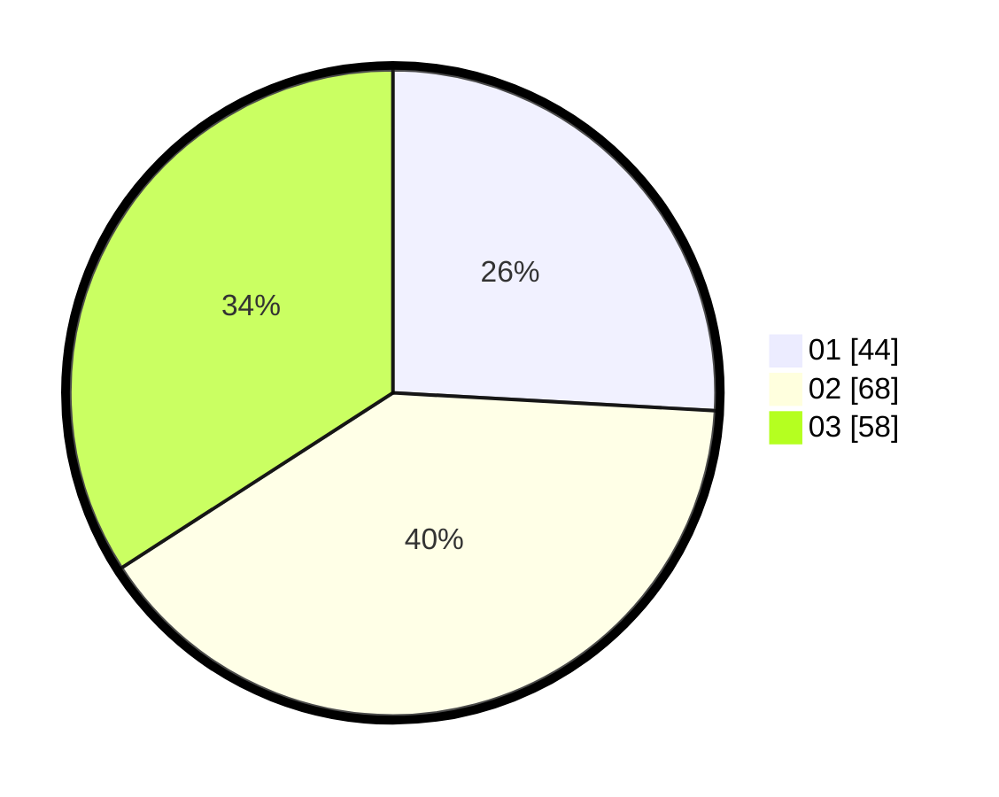

# Hasil

Hasil perolehan suara paslon dapat dilihat pada file paslon-01.txt, paslon-02.txt, dan paslon-03.txt.

Jika tidak ada, artinya data tersebut belum ada pada SIREKAP.

## Perolehan Suara

 * Paslon 01: **44**.
 * Paslon 02: **68**.
 * Paslon 03: **58**.

## Foto C Plano

https://sirekap-obj-formc.kpu.go.id/ac56/pemilu/ppwp/31/71/01/10/05/3171011005036-20240216-071117--24230513-31fc-4ecf-b706-ad680064498c.jpg

https://sirekap-obj-formc.kpu.go.id/ac56/pemilu/ppwp/31/71/01/10/05/3171011005036-20240216-071118--948fd6e8-8a7d-4a1a-bcb4-efa87c80f5c1.jpg

https://sirekap-obj-formc.kpu.go.id/ac56/pemilu/ppwp/31/71/01/10/05/3171011005036-20240216-071117--44aca860-9b4d-4af6-84dd-cd7a8f971fe1.jpg

## DATA PEMILIH TETAP

Jumlah pemilih dalam DPT: **241**.
 * L: **113**.
 * P: **128**.

## DATA PENGGUNA HAK PILIH

Jumlah pengguna hak pilih dalam DPT: **164**.
 * L: **76**.
 * P: **88**.

Jumlah pengguna hak pilih dalam DPTb: **7**.
 * L: **2**.
 * P: **5**.

Jumlah pengguna hak pilih dalam DPK: **0**.
 * L: **0**.
 * P: **0**.

Jumlah pengguna hak pilih: **171**.
 * L: **78**.
 * P: **93**.

## JUMLAH SUARA SAH DAN TIDAK SAH

JUMLAH SELURUH SUARA SAH: **170**.

JUMLAH SUARA TIDAK SAH: **1**.

JUMLAH SELURUH SUARA SAH DAN SUARA TIDAK SAH: **171**.
